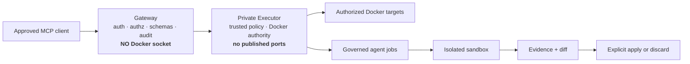
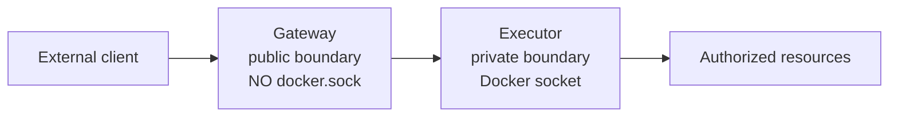
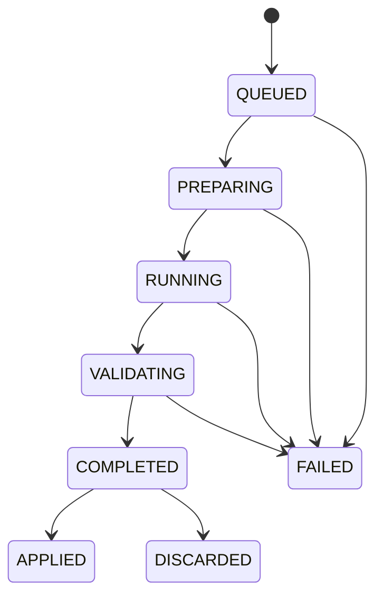

# QuaranGate — Master Product Requirements and Engineering Record

**Document role:** Canonical current-state, design-decision and roadmap reference

**Product:** QuaranGate

**Repository:** `Herman940306/QuaranGate`

**Local project path:** `/home/herman/projects/mcp-ide-bridge`

**Current accepted local source baseline:** `18179696b3ef3ff2192805590027d2e1a43a43d4` — `build: add governed offline npm dependency bundle`

**Documentation reconciliation status:** Finalized against the accepted N1 baseline. Documentation insertion remains a separate uncommitted change until reviewed in the repository.

> [!IMPORTANT]
> This document separates **current accepted capability**, **implemented but still awaiting operational acceptance**, **feasibility evidence**, and **North-Star design**. Historical audit records are preserved in `docs/audits/` and are not rewritten to make old state look current.

---

## Contents

1. [Purpose](#1-purpose)
2. [How to read status claims](#2-how-to-read-status-claims)
3. [Executive summary](#3-executive-summary)
4. [Product problem](#4-product-problem)
5. [Engineering principles](#5-engineering-principles)
6. [Current implemented system](#6-current-implemented-system)
7. [Security architecture](#7-security-architecture)
8. [Authentication and authorization](#8-authentication-and-authorization)
9. [Direct target operations](#9-direct-target-operations)
10. [Agent Control Plane](#10-agent-control-plane)
11. [Evidence, review and apply](#11-evidence-review-and-apply)
12. [Local Ollama backend — O1](#12-local-ollama-backend--o1)
13. [IDE Session Control North Star](#13-ide-session-control-north-star)
14. [Networking and data-leakage model](#14-networking-and-data-leakage-model)
15. [Build and dependency reproducibility](#15-build-and-dependency-reproducibility)
16. [Platform support](#16-platform-support)
17. [Testing and evidence standard](#17-testing-and-evidence-standard)
18. [Operational model](#18-operational-model)
19. [Roadmap](#19-roadmap)
20. [Identity and compatibility decisions](#20-identity-and-compatibility-decisions)
21. [Locked product decisions](#21-locked-product-decisions)
22. [Owner-controlled decisions](#22-owner-controlled-decisions)
23. [Known limitations and open hardening work](#23-known-limitations-and-open-hardening-work)
24. [Historical milestone record](#24-historical-milestone-record)
25. [Change-control rules](#25-change-control-rules)
26. [Definition of done](#26-definition-of-done)
27. [Terminology](#27-terminology)

---

# 1. Purpose

This is the main engineering source of truth for QuaranGate.

It must answer three questions at any point in the project:

```text
Where are we now?
Why is the system designed this way?
What exactly comes next?
```

The document is intentionally broader than a normal product PRD. QuaranGate is a security-sensitive control plane, so architectural history and owner decisions matter as much as feature requirements.

The document therefore records:

- verified current capability;
- important security and architecture decisions;
- the reason behind those decisions;
- current limitations;
- approved future direction;
- owner-controlled choices;
- gate and evidence rules;
- historical milestone references.

It is **not** a substitute for the frozen audit records. Detailed historical evidence remains in `docs/audits/` and other dated qualification documents.

---

# 2. How to read status claims

QuaranGate documentation uses these status categories consistently.

| Status | Meaning |
|---|---|
| **Available** | Implemented, validated and part of the accepted system. |
| **Implemented — acceptance/deployment pending** | Source exists and has passed its defined code qualification, but the intended deployment/runtime acceptance is incomplete. |
| **Feasibility proven / experimental** | A bounded spike or qualification proved an architecture can work. It is not production capability. |
| **Roadmap / North Star** | Approved direction, not implemented. |
| **Not supported** | Deliberately unavailable or rejected by design. |

A feature does not move between these categories because it “looks done”. It moves only when its evidence gate is satisfied.

---

# 3. Executive summary

QuaranGate is a self-hosted **governed execution control plane for AI coding agents**.

It allows authenticated AI clients to perform useful engineering work against explicitly approved development environments without giving those clients unrestricted authority over the host.

Current capability is built around two security domains:



The main product idea is simple:

> AI can investigate, implement and review, but QuaranGate decides what it may access, where it may execute, what evidence it must produce and what requires a separate promotion decision.

The project is not trying to remove the owner from engineering decisions. It is removing repetitive transport and uncontrolled authority.

The target workflow is:

```text
Discuss
  -> define bounded task
  -> owner approves
  -> dispatch governed worker
  -> worker operates in sandbox
  -> collect machine-derived evidence
  -> independent review
  -> owner approves or rejects
  -> apply or discard
  -> validate real source
```

A complementary North-Star program adds governed interaction with an exact enrolled IDE session. That future IDE Session Control Plane is independent of the existing sandboxed Agent Control Plane and must not weaken it.

---

# 4. Product problem

AI development tools are most useful when they can inspect and modify real software environments. The unsafe shortcut is to give an AI client a broad shell, broad filesystem access or direct Docker authority.

That creates several problems:

- prompt injection can become host authority;
- one stolen client credential can become an unrestricted machine credential;
- a model can operate outside the intended repository;
- concurrent agents can race against one worktree;
- “the agent says tests pass” can be mistaken for evidence;
- generated changes can reach live source without a review boundary;
- networked developer tools can leak data even when the selected model itself is local.

QuaranGate introduces a deterministic control layer between AI intent and engineering authority.

---

# 5. Engineering principles

These principles are part of the product, not merely the development process.

## 5.1 Least authority

Each client, component and worker receives only the authority required for its job.

Examples:

- gateway: network-facing protocol and policy, **no Docker socket**;
- executor: private Docker authority, no public listener;
- review target: source read-only;
- work target: source write where approved, Git metadata separately protected;
- agent runner: sandbox only, no Docker socket;
- local-model backend: bounded read-only tools in O1.

## 5.2 Fail closed

Missing configuration, stale state, ambiguous identity or failed proof results in refusal rather than guessed recovery.

This principle appears throughout the system:

```text
unknown target -> deny
ambiguous target -> deny
stale apply base -> deny
missing agent grant -> deny
uncertain rollback -> quarantine
missing offline dependency artifact -> build refuses
```

## 5.3 Evidence before trust

Model prose is not accepted as proof of filesystem, Git, test or runtime state.

QuaranGate prefers:

- machine-generated diffs;
- Git state;
- persisted job metadata;
- exact hashes;
- test output;
- container/image inspection;
- independently repeatable audit evidence.

## 5.4 Generation is not promotion

A worker completing a task does not automatically grant authority to modify live source.

```text
sandbox completion != apply approval
```

## 5.5 Deterministic controls beat prompt instructions

A prompt can tell an AI to stay in a directory. QuaranGate also enforces path boundaries.

A prompt can tell an AI not to use Docker. QuaranGate also withholds the Docker socket.

A prompt can say “read only”. QuaranGate uses read-only mounts/profiles where that property matters.

## 5.6 Local does not automatically mean private

A local model can coexist with an IDE, extension, package manager or build system that still has external network access.

Therefore network qualification is a separate security property.

## 5.7 One controlled live writer

Many readers and isolated workers may exist. The same live project/worktree must not be mutated by several independent writers at once.

## 5.8 Historical evidence stays historical

A test count, verdict or architectural statement that was true at one checkpoint should not be rewritten to look like it was always the current state.

---

# 6. Current implemented system

## 6.1 Current capability summary

| Capability | Status | Key boundary |
|---|---|---|
| Remote MCP gateway | **Available** | Authenticated Streamable HTTP, operator-controlled ingress |
| Direct filesystem operations | **Available** | Authorized target + confined workspace |
| Bounded terminal execution | **Available** | Authorized target, timeout/output limits |
| Git/process inspection | **Available** | Read-oriented wrappers |
| Per-client principals | **Available** | Independent credentials/scopes/allowlists |
| OAuth browser façade | **Available** | DCR, PKCE S256, resource binding |
| Durable job engine | **Available** | Executor-owned SQLite |
| Kiro Agent Control Plane backend | **Available** | Governed sandbox execution |
| `agent_diff` | **Available** | Machine-derived stored evidence |
| `agent_apply` | **Available** | Separate apply grant + guarded transaction |
| `agent_discard` | **Available** | Live source untouched |
| Retained-resource lifecycle | **Available** | Evidence lifecycle governed independently |
| Governed offline npm source build | **Available** | Lock-scoped bundle; canonical lock; source build network `none` |
| O1 local Ollama backend | **Implemented — controlled runtime acceptance pending** | Read-only local backend; model frozen |
| GitHub Copilot backend | **Roadmap** | A7 |
| Session continuity | **Roadmap** | A8 |
| IDE Session Control | **North Star** | Design/feasibility evidence only |

## 6.2 Deliberately unavailable authority

QuaranGate does not expose:

- arbitrary host shell execution;
- arbitrary Docker API access;
- caller-selected host bind mounts;
- caller-selected privileged mode;
- caller-selected runner images;
- automatic cloud fallback;
- implicit apply after agent completion;
- cross-principal administrative override of job ownership;
- an MCP operation that clears `QUARANTINED` project state casually.

---

# 7. Security architecture

## 7.1 Privilege split



### Why this implementation?

Direct Docker control is high-impact. Eliminating Docker authority entirely would remove core QuaranGate functionality, so the design instead concentrates that authority into a private component and keeps it away from the internet-facing process.

This does **not** mean a compromised gateway is harmless. It means a compromised gateway does not directly gain raw Docker/host authority and remains mediated by the executor's configured API and policy checks.

## 7.2 Docker socket risk

`/var/run/docker.sock` is effectively host-level authority. The executor therefore remains part of the trusted computing base.

Mitigations include:

- no published executor ports;
- private internal network;
- non-root process where practical;
- capability dropping/read-only filesystem hardening;
- narrow application API instead of raw Docker passthrough;
- caller inability to choose arbitrary host paths/images/mounts;
- audit and independent source validation.

Residual risk remains high if the executor or Docker daemon itself is compromised.

## 7.3 Workspace confinement

Direct target operations use workspace-relative inputs and canonical path checks.

The purpose is to defend against:

```text
../../ escape
absolute-path escape
symlink escape
wrong-workspace access
```

Path confinement is enforced in code rather than relying on the caller's prompt.

## 7.4 Agent sandbox

Write-capable coding agents receive a sandbox copy rather than the live project as their normal working surface.

The worker does not receive:

- Docker socket;
- arbitrary host home;
- unrestricted host mounts;
- privileged mode;
- the authority to apply its own result automatically.

---

# 8. Authentication and authorization

## 8.1 Per-client API key hashing

Client API keys are stored as **SHA-256 hashes** in configuration rather than plaintext secrets.

```text
raw client key
    -> held by client/operator
    -> SHA-256
    -> stored keyHash
```

### Why hash them?

If normal client configuration is exposed, it should not contain an immediately reusable plaintext credential.

### What hashing does not protect

- a raw key copied into a transcript or shell history;
- an attacker who already possesses the raw key;
- excessive authority granted to that principal.

A leaked raw key must be rotated.

## 8.2 OAuth browser path

Browser integration uses a standards-oriented OAuth façade with:

- Dynamic Client Registration;
- exact redirect URI checks;
- PKCE S256;
- authorization-code binding;
- MCP resource binding;
- rotating refresh tokens;
- bounded persisted state.

OAuth resolves to the same principal/permission model as a static API key.

## 8.3 Authorization dimensions

Direct target operations consider:

```text
principal
scope
target
```

Agent operations additionally consider:

```text
project
backend
profile
job ownership
apply authority
```

Future IDE Session Control adds:

```text
enrolled IDE instance
workspace/worktree
current session
capability/action
connection generation
controller/writer lease
```

No one authority family silently implies another.

---

# 9. Direct target operations

QuaranGate exposes IDE-style operations inside authorized Docker targets.

Current families include:

```text
target discovery/inspection
filesystem read/list/stat/search/write/patch/delete
bounded terminal execution
Git status/diff/log
process inspection
```

## Why use target IDs instead of host paths?

The client should be allowed to say:

```text
target = review
```

not:

```text
mount /home/herman
container = arbitrary-id
workspace = /
```

Trusted configuration maps logical identifiers to the deployment resources the operator has approved.

## Target discovery is not authorization

A container may be discoverable and still unusable by a principal without the matching grant.

---

# 10. Agent Control Plane

The Agent Control Plane removes the manual clipboard loop between the engineering lead and implementation agent while preserving explicit approval boundaries.

## 10.1 Public lifecycle

Implemented agent tools include:

```text
agents_list
agent_projects
agent_dispatch
agent_status
agent_result
agent_cancel
agent_diff
agent_apply
agent_discard
```

## 10.2 Job lifecycle



`FAILED` is a documentation aggregate for distinct terminal failure classifications in code; it is not intended to erase the actual failure reason.

## 10.3 Profiles

Profiles are enforcement policies, not merely different system prompts.

Current design families include:

```text
audit
plan
implement
review
```

A profile controls what the worker may read/write, which commands are appropriate, resource limits and network policy.

## 10.4 One writer

The initial model deliberately serializes write authority. Reliability is more important than maximizing agent concurrency.

Parallel read-only analysis can scale later without allowing several workers to mutate one live worktree.

---

# 11. Evidence, review and apply

## 11.1 `agent_diff`

`agent_diff` returns machine-generated evidence from the retained sandbox/artifact state.

It is not simply the worker's prose description of what it changed.

Useful evidence includes:

- exact changed-file list;
- unified diff;
- full diff hash;
- base identity;
- bounded pagination/truncation metadata.

## 11.2 `agent_apply`

Apply is a separate authority.

It must validate:

```text
job complete
job still eligible
principal has apply grant
project still matches compatible base
working-tree policy satisfied
guarded paths allowed
stored evidence matches
dedicated apply transaction can proceed
```

The caller does **not** supply arbitrary new patch text during apply.

### Why this matters

The thing that was reviewed should be the thing QuaranGate attempts to promote.

Re-asking an AI to reconstruct “the same change” at apply time would break that evidence chain.

## 11.3 Guarded paths

Sensitive paths may be denied from application regardless of what the agent asks for.

Typical examples include secrets, credential files and security-critical configuration.

## 11.4 Rollback and quarantine

If apply fails, QuaranGate attempts rollback and must prove the resulting state.

If rollback cannot be proven, the result is **UNCERTAIN** and the project is quarantined from further apply operations.

### Why quarantine instead of guessing?

A false success is more dangerous than a visible blocked state. An uncertain project must be inspected deliberately rather than silently allowed to continue.

---

# 12. Local Ollama backend — O1

O1 adds a governed local Ollama backend for bounded read-only audit/plan/review work.

## 12.1 Status

**Source/model qualification is complete. Controlled container deployment and post-deploy acceptance are still pending.**

The documentation must not collapse those into the single word “operational”.

## 12.2 Selected model hierarchy

Current owner-approved hierarchy:

```text
PRIMARY
qwen3.5:4b-q4_K_M

CAPACITY RESERVE
qwen3.5:9b-q4_K_M

QUALIFIED ALTERNATE
ministral-3:8b-instruct-2512-q4_K_M
```

No automatic fallback is authorized.

## 12.3 O1 security design

The local backend exposes exactly bounded read-only tools rather than the general executor filesystem surface.

Current tool intent:

```text
read_file
list_files
literal_search
```

Key reasons:

- limit aggregate reads;
- avoid arbitrary recursive search behavior;
- deny sensitive paths using trusted policy;
- keep model capability below general terminal/filesystem authority;
- make local inference useful without turning “local” into an excuse for broad access.

## 12.4 Deployment design

The owner-approved deployment direction uses:

- dedicated Ollama Compose override;
- private inference network;
- no gateway attachment;
- no host-published Ollama port for the QuaranGate service;
- pinned local image;
- explicit GPU selection;
- dedicated model volume;
- offline/controlled model seeding;
- backend disabled until infrastructure checks pass.

Production documentation must not instruct the running QuaranGate deployment to perform an uncontrolled online `ollama pull`.

## 12.5 Container-version qualification boundary

The host Ollama environment used during model qualification and the selected container Ollama version are different runtime versions.

The container runtime therefore requires canary requalification before production acceptance.

---

# 13. IDE Session Control North Star

The future IDE Session Control Plane allows an authorized client to communicate with an exact enrolled interactive IDE session.

It is **not** a replacement for the Agent Control Plane.

See `docs/IDE_SESSION_CONTROL.md` for the full contract.

## 13.1 Required targets

```text
I1 Kiro
I2 VS Code
I3 Cursor
```

Secondary feasibility targets:

```text
I4 Visual Studio
I5 Antigravity
```

I6 covers concurrency, recovery and hardening required before production acceptance.

## 13.2 Two adapter classes

**Architecture A — provider session interface**

Use a supported vendor session/control interface where one exists and is independently qualified.

**Architecture B — QuaranGate-owned IDE participant/adapter**

Use supported IDE APIs to provide a QuaranGate-owned interactive agent surface and authenticated local machine interface.

VS Code S1 proved Architecture B feasible. That spike is not production-ready and does not prove full IDE-host air-gap behavior.

## 13.3 Shared writer boundary

Plane A apply, direct live-workspace mutation and mutation-capable IDE interaction must participate in the same project/worktree live-writer arbitration.

---

# 14. Networking and data-leakage model

QuaranGate distinguishes several network planes.

```text
PUBLIC CONTROL PLANE
client -> operator-approved ingress -> MCP gateway

PRIVATE PRIVILEGED PLANE
gateway -> executor over private Docker network

AGENT DATA PLANE
runner/backend -> only explicitly approved provider endpoints

LOCAL INFERENCE PLANE
executor/backend -> private Ollama service

FUTURE PRIVATE OPERATIONS PLANE
operator -> tailnet/private admin and metrics surface
```

## 14.1 Public != admin != agent egress

One network path should not handle every trust purpose.

## 14.2 Leakage standard

For any network-enabled step, documentation and acceptance should distinguish:

```text
package/dependency metadata egress
provider prompt/content egress
project-source egress
credential egress
telemetry/host-product egress
```

## 14.3 IDE host caveat

The VS Code S1 work proved the QuaranGate spike/provider path could be local and non-forwarding. Separate tracing also showed broader IDE-host networking from other product/extension behavior.

Therefore:

> A local model or local adapter is not enough evidence to call the entire IDE host air-gapped.

---

# 15. Build and dependency reproducibility

## 15.1 Tini C2

Tini 0.19.0 is now preserved as an exact local third-party artifact.

Accepted binary SHA-256:

```text
1358f1be32dc2a0dd8084dbda675c3b3dde8352b519b7b8a65573262551ad0fc
```

License SHA-256:

```text
e5f46bca81266bdd511cf08018d66866870531794569c04f9b45f50dd23c28b0
```

### Why vendor Tini?

The old Docker build used Alpine package acquisition during image construction. That meant a build could require external networking and could depend on repository state outside the QuaranGate source.

The C2 change instead:

- preserves the exact trusted 0.19.0 binary;
- records provenance;
- verifies its hash during the Docker build;
- keeps `ENTRYPOINT ["/sbin/tini", "--"]` semantics;
- removes the Tini package-download dependency.

### Upgrade policy

Vendoring 0.19.0 does not freeze Tini forever. A future version change should be an explicit dependency update with provenance, hash review and regression validation.

## 15.2 npm dependency build — N1 accepted

N1 closed the remaining npm network dependency in the real source build at:

```text
18179696b3ef3ff2192805590027d2e1a43a43d4
build: add governed offline npm dependency bundle
```

Accepted architecture:

```text
CONTROLLED DEPENDENCY PREPARATION
package.json + package-lock.json + preparation tool
        |
        | source-free networked container
        | exact registry.npmjs.org HTTPS tarball URLs only
        | 221/221 lock entries carry SHA-512 SRI
        v
lockfile-scoped external bundle
        |
        | descriptor + manifest + every artifact reverified
        v
REAL SOURCE BUILD
BuildKit named context mounted read-only
network = none
fresh tmpfs npm cache from verified tarballs
canonical package-lock.json unchanged
npm ci --offline --ignore-scripts
```

Accepted baseline facts:

```text
package-lock SHA-256:
31688b0a46cb5051e069ff049bbafd34752ace10dfb9dac3a60c9a3fef5258e5

lock package entries:     221
unique artifact bodies:   220
SHA-512 coverage:         221 / 221
approved dependency host: registry.npmjs.org:443
bundle manifest SHA-256:  43eb077e7f23c23014882738508b624dd738cc0315d5ea8730392e15e6aec788
bundle bytes:             148675638
```

Independent acceptance proved:

- normal source/runtime Compose parsing remains usable when the bundle path is unset;
- an attempted build without a valid bundle fails closed before npm;
- `npm ci --offline --ignore-scripts` succeeds against the canonical lock;
- a no-cache Docker build succeeds with build network `none` and `pull=false`;
- Tini remains exactly 0.19.0 with the accepted hash;
- dependency bundle artifacts and temporary npm cache are absent from the runtime image;
- the live QuaranGate gateway/executor were unchanged by acceptance.

The networked preparation step intentionally sees only the two package manifests, the preparation tool and the artifact output location. Application source, Git state, runtime configuration, Docker socket and credentials are not mounted into that preparation container.

## 15.3 Build claim boundary

Even after a successful offline source build, a truly empty machine cannot build with zero external/pre-provisioned artifacts.

At minimum an offline machine still needs:

```text
source checkout
base image layers
verified npm dependency artifacts
required local third-party artifacts
```

The goal is deterministic **pre-provisioned offline building**, not an impossible “nothing exists but no network is needed” claim.

---

# 16. Platform support

QuaranGate is intended to be portable across common developer-host environments, while test claims remain evidence-based.

| Platform | Intended design | Current evidence |
|---|---|---|
| Linux + Docker | Yes | Architecture is Linux-container native; broader independent platform qualification still required for release claims. |
| Windows 11 + WSL2 + Docker Desktop | Yes | Primary current development/acceptance environment. |
| macOS + Docker Desktop | Yes by design | Requires explicit qualification, especially Apple Silicon/base-image behavior. |
| Native Windows containers / no WSL2 | Not currently claimed | Different execution model; not part of current acceptance. |

The implementation should avoid hard-coded operator home paths and Windows/macOS-specific Dockerfile assumptions.

---

# 17. Testing and evidence standard

QuaranGate uses layered evidence rather than one “all tests pass” statement.

## 17.1 Evidence layers

```text
source scope
static/type validation
unit tests
integration tests
adversarial tests
Docker/runtime inspection
live client acceptance
independent review
promotion verification
```

## 17.2 Test counts are checkpoint evidence

Counts change as the project grows.

The documentation should show the current accepted count while preserving older counts as historical milestones.

Current accepted source baseline after N1:

```text
HEAD: 18179696b3ef3ff2192805590027d2e1a43a43d4
TypeScript typecheck: PASS
44 / 44 unit test files PASS
1693 / 1693 unit tests PASS
normal source build: PASS
offline/no-cache Docker build with pre-provisioned inputs: PASS
```

The immediately preceding Tini-only baseline (`6129d3d`) remains historical evidence at 43 files / 1671 tests.

## 17.3 Why independent audits matter

The same agent that implemented a change may have blind spots. Critical gates therefore use independent read-only review wherever practical.

This includes:

- scope/diff review;
- security review;
- test completeness review;
- runtime acceptance;
- post-promotion verification.

---

# 18. Operational model

Detailed procedures live in `docs/OPERATIONS.md`.

The high-level operational rules are:

- live configuration is separate from committed examples;
- client credentials are generated per principal;
- image provenance matters;
- readiness and liveness are separate;
- deployment/push/restart are explicit owner-authorized steps;
- local models and dependency artifacts are prepared under controlled procedures;
- rollback anchors are retained until acceptance closes;
- production claims require runtime evidence, not only source tests.

The accepted offline build procedure is recorded in `docs/OPERATIONS.md`. Dependency acquisition and source compilation remain separate trust domains.

---

# 19. Roadmap

## 19.1 Agent Control Plane program

| Gate | Purpose | Status |
|---|---|---|
| A0 | Forensic readiness | Complete |
| A1 | Contracts, scopes, state model | Complete |
| A2 | Durable job engine + fake backend | Complete |
| A3 | Isolated runner sandbox | Complete |
| A4 | Kiro ACP read-only | Complete |
| A5 | Kiro sandbox implementation | Complete |
| A6 | Diff / apply / discard / retained-resource lifecycle | Complete |
| A7 | GitHub Copilot backend | Not started |
| A8 | Session continuity | Not started |
| A9 | Production hardening + full E2E | Not started |

## 19.2 Parallel local Ollama milestone

O1 is an owner-approved parallel backend milestone and does not renumber A0-A9.

Current state:

```text
implementation merged
model qualification complete
primary/capacity/alternate frozen
controlled container deployment pending
post-deploy acceptance pending
```

## 19.3 IDE Session Control program

| Gate | Purpose | Status |
|---|---|---|
| I0 | Common authority/security contract | Design documented |
| I1 | Kiro | Not started |
| I2 | VS Code | Architecture B feasibility proven; production adapter not started |
| I3 | Cursor | Not started |
| I4 | Visual Studio | Secondary feasibility |
| I5 | Antigravity | Secondary feasibility |
| I6 | Concurrency/recovery/hardening | Not started; required before production |

---

# 20. Identity and compatibility decisions

QuaranGate is the canonical product identity.

The GitHub repository is:

```text
Herman940306/QuaranGate
```

Several runtime identifiers intentionally retain legacy names where changing them would create compatibility or data risk.

## 20.1 Preserve historical evidence

Historical references to:

```text
MCP IDE Bridge
AgentControl
mcp-ide-bridge
mcp-bridge
```

remain valid where they describe the real state at that time.

Zero legacy strings is not the objective. Zero unexplained **current-facing** legacy identity is.

## 20.2 Credential prefixes remain stable

Prefixes such as:

```text
mcpb_
mcpb_at_
mcpb_rt_
mcpb_ac_
```

are treated as security/protocol namespaces rather than product branding and are intentionally preserved.

## 20.3 Durable job volume

The physical durable job volume retains its legacy name because it contains schema-versioned state and evidence metadata.

Reason:

> Copying a durable database merely for cosmetic naming introduces more recovery risk than value.

A future Compose project may use a neutral logical key while continuing to mount the existing physical volume.

## 20.4 Disposable gateway OAuth data

Gateway OAuth state is documented as disposable/re-authorizable. The owner approved recreating it under the canonical QuaranGate runtime identity during the controlled runtime cutover rather than preserving cosmetic legacy naming indefinitely.

## 20.5 Label compatibility

Runtime ownership/evidence label migration uses a compatibility model rather than a blind hard rename.

The important principle is:

```text
read old + new during migration
write new after cutover
```

This prevents old evidence/resources becoming invisible to cleanup and retention logic.

## 20.6 Secret-path migration

The Kiro automation secret path migration is deliberately separate from the larger runtime rename.

When authorized, the migration should:

- deploy new-first / legacy-fallback read behavior first;
- move rather than duplicate the secret;
- preserve restrictive permissions/ownership;
- prove new-path startup;
- remove legacy fallback later through a separate closeout.

---

# 21. Locked product decisions

Unless the owner explicitly reopens them, the following are controlling decisions.

- QuaranGate is the canonical product identity.
- ChatGPT is the primary planning/orchestration collaborator in the intended user workflow.
- Kiro is an implemented Agent Control Plane worker.
- GitHub Copilot is the next formal backend target under A7.
- Agent work is sandbox-first.
- Completing a job never implies automatic live apply.
- Gateway does not receive Docker socket authority.
- Executor remains private/unpublished.
- Agent runners do not receive Docker socket authority.
- Public callers use logical project/target IDs rather than arbitrary host paths.
- Least privilege is preferred over broad `--allow-all` / `--yolo` / `--trust-all-tools` modes.
- Guarded paths hard-refuse rather than warn.
- Automatic cloud/model fallback is not authorized.
- O1 model hierarchy is explicit rather than automatic fallback.
- IDE chat plane and Agent Control Plane are independent.
- Kiro, VS Code and Cursor are required IDE Session Control targets.
- Visual Studio and Antigravity are secondary feasibility targets.
- One controlled live writer per project/worktree remains the safety model.
- Historical audits are preserved rather than rewritten.
- Tini is pinned as a locally verified third-party build artifact until an explicit upgrade gate changes it.
- npm offline-build architecture uses source-free dependency preparation and a lockfile-scoped external artifact bundle; N1 accepted the real source build with networking disabled and the canonical lock unchanged.

---

# 22. Owner-controlled decisions

QuaranGate's governance model distinguishes implementation details the engineering agent may solve from deployment/product choices reserved for the owner.

Typical owner-controlled decisions include:

- model selection;
- runtime resource allocation;
- GPU assignment;
- host paths;
- persistent storage location;
- ports/ingress exposure;
- credential provisioning/migration;
- backend enablement;
- external network authorization;
- deployment/promotion;
- upgrades with compatibility/security implications;
- deletion of rollback anchors;
- reopening a locked architecture decision.

Engineering agents should recommend and explain these choices, but not silently decide them.

---

# 23. Known limitations and open hardening work

Current known limitations/debt include:

- N1 is accepted, but the dependency-preparation container's external-host restriction is enforced at the application URL-validation layer rather than by a kernel-level egress firewall;
- the Dockerfile still uses the mutable base tag `node:24-alpine`, so cross-machine bit-for-bit base-image reproducibility is not yet proven by source pinning alone;
- `validateResolvedUrl` could be defense-in-depth hardened against redundant double-slash registry paths even though exact-host validation plus mandatory SHA-512 prevents artifact substitution;
- O1 container-runtime canary/acceptance remains pending;
- O1 production activation remains pending;
- GitHub Copilot backend A7 not started;
- session continuity A8 not started;
- A9 production hardening/E2E not complete;
- IDE Session Control production adapters not implemented;
- IDE-host egress/air-gap qualification remains separate and unresolved;
- macOS has not yet received the same acceptance evidence as the current WSL2 environment;
- current MCP/SDK ecosystem has evolved beyond the original implementation baseline and requires a separate compatibility/migration decision rather than silent version churn;
- the executor/Docker socket remains a high-impact trusted boundary by design.

This list should remain focused on real unresolved product/security work rather than every minor code-cleanliness item.

---

# 24. Historical milestone record

Detailed evidence belongs in the frozen phase documents. This section records the high-level progression.

## 24.1 Initial bridge

The original implementation established:

- MCP gateway/executor split;
- direct target operations;
- API-key principals;
- OAuth browser compatibility;
- Claude/ChatGPT browser acceptance;
- structured output schemas.

## 24.2 Agent Control Plane A0-A6

The Agent Control Plane then progressed through:

```text
forensic readiness
contracts and policy
persistent job engine
sandbox foundation
real Kiro read-only backend
Kiro sandbox implementation
machine diff / guarded apply / discard
retained-resource lifecycle
```

Every gate has a preserved audit record under `docs/audits/`.

## 24.3 Identity migration

Product identity was reconciled to QuaranGate while preserving runtime compatibility where a blind rename would risk evidence, persistent state or rollback.

The GitHub repository rename is complete. Runtime compatibility migrations remain governed separately rather than being treated as branding-only changes.

## 24.4 IDE chat S1

VS Code S1 proved the QuaranGate-owned Chat Participant / machine IPC architecture feasible while explicitly retaining:

```text
PRODUCTION_READY = NO
AIRGAP_CERTIFIED = NO
```

## 24.5 O1 and build reproducibility

The local Ollama backend was implemented and model-qualified. Its deployment path exposed build reproducibility issues, leading to:

- Tini C2 local vendoring/provenance;
- npm N1 lock-scoped dependency bundling and source-build network isolation.

N1 closed at `18179696b3ef3ff2192805590027d2e1a43a43d4` with 44/44 unit test files and 1693/1693 tests, plus an independently rechecked no-cache/network-none Docker build. O1 container canary/deployment acceptance remains separate and pending.

This is an example of the project treating deployment evidence as part of the feature rather than stopping at source compilation.

---

# 25. Change-control rules

Every serious implementation gate should define:

```text
MODE
AUTHORITATIVE STATE
OBJECTIVE
AUTHORIZED ACTIONS
FORBIDDEN ACTIONS
SUBAGENT POLICY
PREFLIGHT
IMPLEMENTATION
VALIDATION
STOP CONDITIONS
RETURN CONTRACT
NEXT-PHASE PROHIBITION
```

## 25.1 One writer

Parallel read-only subagents are encouraged where they reduce uncertainty.

Only one writer is allowed per worktree unless isolated branches/worktrees are explicitly designed and approved.

## 25.2 No inherited writer verdict

An independent reviewer does not simply accept:

```text
VERDICT=PASS
```

from the implementing agent.

It inspects the actual evidence.

## 25.3 Promotion is separate from implementation

```text
implementation success
!= commit
!= push
!= deployment
!= production acceptance
```

Each boundary is separately authorized and revalidated.

## 25.4 Fail on drift

Unexpected HEAD, staging, worktree mutation, live runtime change or evidence mismatch stops the gate.

---

# 26. Definition of done

The North-Star product is not done merely because it can launch agents.

A mature QuaranGate must prove:

```text
[ ] authenticated clients receive only explicit authority
[ ] logical resources cannot become arbitrary host access
[ ] gateway remains without Docker socket
[ ] executor remains private
[ ] workers remain sandboxed/no Docker socket
[ ] direct target operations remain workspace-confined
[ ] Kiro backend remains governed
[ ] Copilot backend works under the same neutral contract
[ ] exact machine-derived evidence is reviewable
[ ] guarded apply refuses stale/forbidden state
[ ] rollback and quarantine behavior is proven
[ ] jobs and evidence recover predictably across normal restarts
[ ] session continuity is explicit and secure
[ ] IDE Session Control binds exact enrolled IDE/workspace/session authority
[ ] live-writer arbitration spans all live mutation paths
[ ] credentials remain outside source/results/logs
[ ] network/data-leakage boundaries are explicit and tested
[ ] builds are reproducible from approved pre-provisioned artifacts without source-visible package egress
[ ] Linux/WSL/macOS support claims match actual qualification
[ ] real MCP client acceptance remains green
[ ] current documentation matches the actual system
```

---

# 27. Terminology

**Principal**

A named authenticated client identity with its own permissions.

**Target**

A Docker environment explicitly registered/opted in for direct QuaranGate operations.

**Project**

A trusted source repository registered for governed agent work.

**Backend**

The worker implementation used for an agent job, such as Kiro or the local Ollama backend.

**Profile**

An enforcement policy describing what a job may do, such as audit, plan, implement or review.

**Sandbox**

An isolated copy of project source used by an agent so normal implementation does not mutate live source directly.

**Evidence**

Machine-derived persisted information used to prove what a job produced and what is eligible for review/apply.

**Apply**

The separate governed transition that promotes previously reviewed evidence into the live project.

**Quarantine**

A fail-closed project state used when an apply/rollback outcome cannot be proven safe.

**North Star**

The approved intended end-state architecture. It does not imply the capability is already implemented.

---

## Related documents

- [`README.md`](README.md) — public front door and usage overview
- [`docs/ARCHITECTURE.md`](docs/ARCHITECTURE.md) — current and North-Star architecture
- [`docs/SECURITY.md`](docs/SECURITY.md) — threat model, controls and residual risk
- [`docs/AGENT_CONTROL_PLANE.md`](docs/AGENT_CONTROL_PLANE.md) — agent contracts and lifecycle
- [`docs/IDE_SESSION_CONTROL.md`](docs/IDE_SESSION_CONTROL.md) — future IDE-session authority model
- [`docs/O1_MODEL_QUALIFICATION.md`](docs/O1_MODEL_QUALIFICATION.md) — local-model evidence and deployment boundary
- [`docs/OPERATIONS.md`](docs/OPERATIONS.md) — operator procedures
- [`docs/TEST_RESULTS.md`](docs/TEST_RESULTS.md) — current and historical validation record
- [`PLAN.md`](PLAN.md) — preserved original implementation plan
- [`docs/audits/`](docs/audits/) — frozen gate evidence
