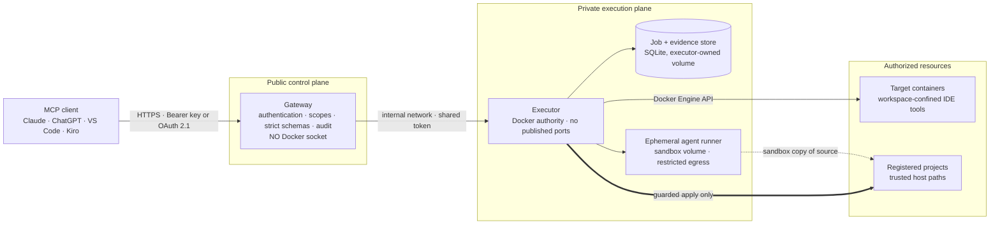
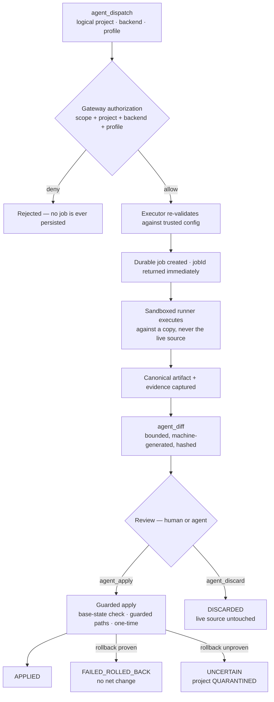
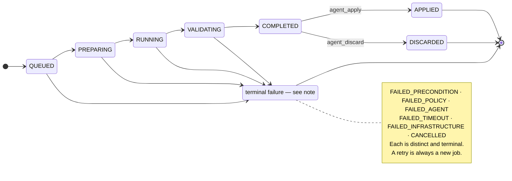

# QuaranGate

**Governed execution for AI coding agents.**

A governed execution control plane that lets AI clients do real work on approved
developer environments — without handing them the host, the Docker socket, or the
right to change anything unreviewed.

> ⚠️ **Privileged component.** The `executor` service holds the Docker socket, which is
> root-equivalent on the host. It is deliberately private, unpublished, and unreachable
> from the network. Read [`docs/SECURITY.md`](docs/SECURITY.md) before exposing any part
> of this to a network beyond loopback.

---

## What QuaranGate is

QuaranGate is a self-hosted, remote **MCP (Model Context Protocol) server** that gives
authenticated AI clients — including Claude, ChatGPT, Codex, VS Code, and Kiro — governed
capabilities mediated by a deterministic authorization layer.

The first is **direct authorized-workspace operations**: workspace-confined filesystem operations, bounded
terminal execution, and read-only Git and process inspection, scoped to explicitly
authorized Docker target containers.

The second is the **Agent Control Plane**: a client can dispatch a coding agent to work on
a registered project, then inspect what it produced and decide whether to keep it. The
agent runs inside an ephemeral, network-restricted sandbox against a *copy* of the project.
Its output becomes reviewable evidence — never an automatic write to your source tree.
Applying that work to the real project is a separate, explicitly authorized, one-time
operation.

The approved North Star adds a separate **IDE Session Control Plane**: when explicitly authorized,
a client may communicate through QuaranGate with the IDE chat plane in an exact, enrolled IDE
instance and workspace, through supported IDE integration such as a QuaranGate-owned Chat
Participant or a qualified provider session interface. This plane is independent of the CLI/agent
plane and does not require attachment to a pre-existing vendor-private chat session. Kiro, VS Code,
and Cursor are primary required targets; Visual Studio and Antigravity are secondary feasibility
targets. The VS Code Chat Participant architecture was proven feasible in S1
(`docs/IDE_CHAT_VSCODE_S1.md`); no production adapter is implemented. This capability is designed
in [`docs/IDE_SESSION_CONTROL.md`](docs/IDE_SESSION_CONTROL.md) but is **not implemented**.

The whole system is built around one boundary: **the component that talks to the internet
is not the component that holds privilege.**

> **On naming.** *QuaranGate* is the current project identity; it supersedes the earlier
> *AgentControl* name. The npm package and the MCP server's own self-identification are
> `quarangate`. Several internal **runtime** identifiers — the Compose project name,
> Docker networks and volumes (`mcp-ide-bridge`, `mcp-bridge-*`), and Docker label
> namespaces (`io.mcp-ide-bridge.*`, `io.mcp-bridge.*`) — intentionally retain their
> earlier names for compatibility, evidence discoverability, and rollback safety. A
> controlled compatibility migration for these is designed but not yet executed; see
> `MCP_IDE_BRIDGE_MASTER_PRD.md` §47 for the full migration contract.

## Why it exists

Connecting a capable AI client to a real development machine usually means one of two bad
options: give it nothing useful, or give it a shell. The second option quietly grants the
model — and anything that can prompt-inject it — the authority of the account running it.

QuaranGate inserts a control layer that makes authority explicit and enumerable:

- Callers address **logical identifiers** (`demo`, `example-project`), never host paths,
  container images, mounts, or Docker options. Those are trusted, executor-owned config.
- Every tool call is checked against a **per-client principal**: scopes, target allowlist,
  and separate agent project/backend/profile grants. Absent grants mean deny.
- **Target permission never implies agent permission.** A client with full filesystem
  access to a container has zero ability to dispatch an agent.
- **Agent Dispatch and IDE Session authority are independent.** Neither implies the other, and
  discovery never grants ambient access to open IDEs or sessions.
- Agent output is **generated into a sandbox, reviewed, then applied** — three separate
  authorizations, not one.

## Current capabilities

| Capability | Status | Notes |
|---|---|---|
| Remote authenticated MCP over Streamable HTTP | **Available** | Single `/mcp` endpoint; stateless server per request |
| Filesystem read / write / patch / delete / search | **Available** | Confined to one authorized container workspace |
| Bounded terminal execution | **Available** | Timeout, 256 KiB output cap, concurrency limits |
| Git and process inspection | **Available** | Read-only, fixed argv |
| Per-client principals, scopes, target allowlists | **Available** | Deny by default |
| OAuth 2.1 façade (DCR + PKCE S256) | **Available** | State persisted hashed on the gateway data volume |
| Durable agent job engine | **Available** | SQLite on an executor-owned volume; restart-safe |
| Sandboxed agent execution (Kiro, ACP) | **Available** | Ephemeral runner: non-root, `cap_drop: ALL`, read-only rootfs, no host binds, no Docker socket |
| Read-only agent profiles (`audit`, `plan`, `review`) | **Available** | Workspace never writable |
| Sandbox-write agent profile (`implement`) | **Available** | Writes to a sandbox copy, never the live project |
| `agent_diff` — machine-generated, bounded diffs | **Available** | Canonical artifact, hashed, cursor-paged |
| `agent_apply` — guarded application to the real project | **Available** | Base-state verification, guarded paths, one-time |
| `agent_discard` — governed disposal | **Available** | Live source left untouched |
| Retained-resource lifecycle | **Available** | Automatic evidence expiry; metadata retained |
| Liveness / readiness split with fail-closed readiness | **Available** | `/healthz` vs `/readyz` |
| Non-Kiro backends | **Bounded** | Any backend other than `kiro` falls back to a deterministic fake backend (no shell, Docker, network, or AI). Useful for testing, not for real work. |
| Remote browser ingress | **Bounded** | Verified on one deployment via Tailscale Funnel. Ingress is operator-provided and deliberately not enabled by default. |
| GitHub Copilot backend | **Roadmap (A7)** | `copilot` exists as a contract enum id only; disabled in config, no implementation |
| Session continuity / resume | **Roadmap (A8)** | `sessionPolicy: "resume"` is representable but explicitly rejected at dispatch |
| Production hardening + full E2E | **Roadmap (A9)** | Not started |
| Governed Ollama local backend (O1) | **✅ Q1D qualified** | Read-only backend operational; model selection frozen: `qwen3.5:4b-q4_K_M` |
| IDE Session Control | **Approved North Star (I0-I6)** | Design only; no adapter or runtime implementation |

**Explicitly not supported.** Host shell execution. Browser or GUI automation as the primary
authority/production transport. Caller-supplied
host paths, runner images, mounts, network modes, or privilege flags — all rejected by strict
schemas. Cross-principal administrative override of job ownership. Clearing a project
`QUARANTINED` state through any MCP tool.

A future narrow, authenticated companion IDE extension/local adapter is an acceptable machine-facing
transport under the I0 contract; mouse, keyboard, focus, clipboard, and pixel scraping remain
fallback-only and cannot establish authority.

## Architecture

The current implemented architecture uses two containers, two privilege levels, and a non-routable
internal Docker network. The future IDE Session Control Plane is not shown in this runtime diagram.



The gateway holds no Docker socket and mounts no host directories. The executor publishes no
ports and exposes only a narrow API — it has no verb for "arbitrary Docker call", "create
container", "mount host path", or "run on host".

Full detail: [`docs/ARCHITECTURE.md`](docs/ARCHITECTURE.md).

## Security boundaries

| Domain | Holds | Reachable from | Cannot |
|---|---|---|---|
| **Gateway** (public) | Client credentials, OAuth state, authorization matrix | The network you expose it on | Touch Docker, mount host paths, reach targets directly |
| **Executor** (private) | Docker socket, trusted config, job store, evidence | Gateway only, over the internal network with a shared token | Be reached from the host or LAN; act on unconfigured targets |
| **Targets / projects** | Your actual code | Executor only | Be selected by a caller that lacks an explicit grant |

The executor independently re-validates target allowlisting, workspace confinement, project
and backend and profile policy, and job ownership. A compromised gateway does not inherit the
executor's authority.

The gateway binds `127.0.0.1:8787`. Publishing it is an explicit operator action.

Threat model, mitigations, and stated residual risks: [`docs/SECURITY.md`](docs/SECURITY.md).

## Agent workflow

The central property: **generating a change is not applying it.**



A job reaching `COMPLETED` means evidence exists and is reviewable. It does not mean anything
was written to your project.

## Agent job lifecycle



`FAILURE` above is a diagram aggregate, not a status: the six real codes are listed in the
note. Apply attempts have their own separate state machine. The canonical definitions live in
[`docs/AGENT_CONTROL_PLANE.md`](docs/AGENT_CONTROL_PLANE.md) and `src/shared/agents.ts`.

## Review, apply, discard

Three deliberately separate operations with three separate authorizations:

- **`agent_diff`** (`agents:read`) returns a bounded, machine-generated diff derived from
  stored evidence — with a full-diff hash, a truncation flag, and an opaque cursor. Not agent
  prose, and never an unbounded dump.
- **`agent_apply`** (`agents:apply`, plus the project grant) takes **no patch text**. It
  operates only on stored, verified job evidence, and requires: `COMPLETED` status, an
  unapplied disposition, base-state verification (a stale HEAD is refused), guarded-path
  validation, and one-time application. It runs in a dedicated short-lived applier container,
  never in the agent's own runner.
- **`agent_discard`** (`agents:dispatch`) closes the job out without touching live source.

If an apply fails, rollback is attempted and *proven*. If rollback cannot be proven, the
attempt terminates as `UNCERTAIN` and the project is put into `QUARANTINED` state, which
blocks further applies and which no MCP tool can clear. Failing loudly is preferred over
leaving ambiguous state.

## Execution targets and roles

Two independent gates must both pass before a client can use a target: the target must exist
in the bridge (manual config or opt-in discovery), **and** the client's allowlist must include
it. Discovery identifies containers; it never authorizes them.

The repository ships target definitions demonstrating three distinct authority levels:

| Target | Mount | Purpose |
|---|---|---|
| `test-target` | disposable container | Integration fixture. Also ships a `decoy` container that must never be reachable — an active negative test. |
| `review-target`, `assistant-environment-review-target` | source mounted **`:ro`** | Read-only review lanes. An AI client can read, search, and run tooling, but cannot modify the source. |
| `assistant-environment-work-target` | source **`:rw`**, `.git` mounted **`:ro`** | Constrained write lane. The agent may edit files and read history, but the read-only `.git` overlay means it cannot stage, commit, branch, rebase, or push. |

The work target runs as `uid 1000:1000` with `cap_drop: ALL`, so write access comes from
ordinary file permissions rather than privilege, and created files stay owned by the host user.
The host itself is never an implicit target.

See [`docs/TARGETS.md`](docs/TARGETS.md).

## Quick start

Configuration is required — there is no meaningful one-command setup.

```bash
# 1. Secrets and config
cp .env.example .env
#    INTERNAL_TOKEN: openssl rand -base64 32
#    DOCKER_GID:     stat -c %g /var/run/docker.sock
cp config/bridge.example.yaml  config/bridge.yaml     # define targets
cp config/clients.example.yaml config/clients.yaml    # define principals

# 2. Generate a client key (printed once; only its hash is stored)
npm install
npm run gen-key -- vscode        # paste the printed keyHash into config/clients.yaml
npm run validate-config

# 3. Optional: start the disposable demo target
docker compose -f test-target/compose.yaml up -d --build

# 4. Start the bridge
docker compose up -d --build
curl -s http://127.0.0.1:8787/healthz
curl -s http://127.0.0.1:8787/readyz

# 5. Smoke-test the protocol
API_KEY=<your key> ./scripts/mcp-check.sh
```

The Agent Control Plane is **optional and off by default**. Without `config/agents.yaml` the
executor logs "not configured", the agent tools fail closed with `AGENTS_UNAVAILABLE`, and the
rest of the bridge runs normally.

## Configuration

| File | Purpose |
|---|---|
| `.env` | `INTERNAL_TOKEN`, `DOCKER_GID`, `BRIDGE_PUBLIC_URL`, image references |
| `config/bridge.yaml` | Target definitions and discovery settings |
| `config/clients.yaml` | Principals: key hashes, scopes, target allowlist, agent grants |
| `config/agents.yaml` | Trusted agent registry: projects, backends, profiles, resource policies |

Every file has a committed `.example` counterpart. Live config is gitignored. Trusted values —
host paths, runner images, resource limits — exist only in executor-owned configuration and are
never accepted from an MCP caller.

Details: [`docs/CLIENT_SETUP.md`](docs/CLIENT_SETUP.md), [`docs/TARGETS.md`](docs/TARGETS.md),
[`docs/OPERATIONS.md`](docs/OPERATIONS.md).

## Authentication

Two credential types, one identity model. Both resolve to the same per-client principal, so
authorization is identical regardless of how the client authenticated.

- **Static API key** — `Authorization: Bearer <key>` or `X-API-Key`. Generated per client with
  `npm run gen-key`; only the SHA-256 hash is stored. Revoke or rotate per client, independently.
- **OAuth 2.1** — for browser clients that require it: Protected-Resource and Authorization-Server
  metadata, JSON Dynamic Client Registration for public clients, authorization code + PKCE S256,
  exact registered redirect URIs, RFC 8707 resource binding, single-use codes, and rotating
  refresh tokens. The "login" is pasting your bridge API key on the authorization page — browser
  auth is never anonymous.

Missing or invalid credentials fail closed with `401` and advertise the OAuth resource metadata.

## Operational health

Two endpoints with deliberately different jobs:

- **`/healthz` — liveness.** The process is up. Never depends on config or on the executor.
- **`/readyz` — readiness.** Fails closed with `503` unless the clients config loaded *and* the
  executor is reachable.

This split matters. An empty `/config` mount after a reboot leaves a gateway that is running but
cannot authenticate anyone. Liveness alone would report that as healthy. The gateway's Docker
healthcheck therefore probes `/readyz`, so the condition surfaces as **unhealthy** — while the
process stays alive and diagnosable rather than crash-looping. `/readyz` is unauthenticated, so
its body carries no reason; the category is logged at startup instead.

## Project status

Current implementation gate: **A0–A6 complete. A7 is the next gate.**

| Phase | Scope | Status |
|---|---|---|
| A0 | Forensic readiness audit | ✅ Complete |
| A1 | Agent-control specification, contracts, state machine | ✅ Complete |
| A2 | Durable job engine + deterministic fake backend | ✅ Complete |
| A3 | Runner sandbox, resource enforcement, egress policy | ✅ Complete |
| A4 | Kiro ACP backend, read-only profiles | ✅ Complete |
| A5 | Kiro sandbox implementation profile | ✅ Complete |
| A6 | Review / apply / discard + retained-resource lifecycle | ✅ Complete |
| — | Gateway readiness + image-provenance remediation | ✅ Complete |
| A7 | GitHub Copilot backend | ⏭️ Next formal A-gate; not started |
| A8 | Session continuity | 📋 Not started |
| A9 | Production hardening + end-to-end validation | 📋 Not started |

The next formal A-gate remains A7, while a governed Ollama local backend is the owner-approved
immediate milestone in a separate Kiro lane. The additive IDE Session Control program is I0-I6:
I0-I3 are required for the updated North Star, Visual Studio I4 and Antigravity I5 are secondary
feasibility targets, and I6 concurrency/recovery/hardening is required before production acceptance.
None of I0-I6 is implemented or claimed complete. Today exactly one real Agent Control Plane backend
(Kiro) is implemented behind a backend-neutral contract.

**Verified baseline at the current commit:** TypeScript typecheck PASS; 1420 / 1420 unit tests
passing across 35 files. Integration tests require a live Docker stack and are run separately —
see [`docs/TEST_RESULTS.md`](docs/TEST_RESULTS.md) for the full record.

## Documentation

| Doc | Contents |
|---|---|
| [MCP_IDE_BRIDGE_MASTER_PRD.md](MCP_IDE_BRIDGE_MASTER_PRD.md) | Canonical engineering source of truth: requirements, phase gates, decisions |
| [docs/ARCHITECTURE.md](docs/ARCHITECTURE.md) | Components, flows, tool contracts, target model |
| [docs/SECURITY.md](docs/SECURITY.md) | Threat model, mitigations, explicit residual risks |
| [docs/AGENT_CONTROL_PLANE.md](docs/AGENT_CONTROL_PLANE.md) | Agent contracts, scopes, state machines, trusted config |
| [docs/IDE_SESSION_CONTROL.md](docs/IDE_SESSION_CONTROL.md) | I0 architecture, authority, common adapter contract, threat model, and adapter research gates |
| [docs/TARGETS.md](docs/TARGETS.md) | Discovery, opt-in labels, manual targets, permissions |
| [docs/CLIENT_SETUP.md](docs/CLIENT_SETUP.md) | Per-client setup for Claude, ChatGPT, VS Code, Kiro |
| [docs/OPERATIONS.md](docs/OPERATIONS.md) | Build, run, health, credentials, image provenance, ingress |
| [docs/COMPATIBILITY.md](docs/COMPATIBILITY.md) | Client and protocol requirements with citations |
| [docs/O1_MODEL_QUALIFICATION.md](docs/O1_MODEL_QUALIFICATION.md) | O1 Ollama model selection, qualification evidence, deployment guidance |
| [docs/audits/](docs/audits/) | Frozen per-phase audit records (A0–A6) |
| [PLAN.md](PLAN.md) | The original pre-implementation plan (historical) |

## Requirements

Node.js 22+, Docker with Compose, and a Linux or WSL2 host. The project is strict TypeScript,
ESM/NodeNext.

## Security warning

The executor holds `/var/run/docker.sock`. That is root-equivalent authority on the host. It is
mitigated by keeping the executor private, unpublished, non-root, `read_only`, `cap_drop: ALL`,
and restricted to a narrow argv-only API — but it is inherent to the feature and cannot be
eliminated.

**Never give the gateway the Docker socket. Never publish the executor. Never expose this to a
public network without reading [`docs/SECURITY.md`](docs/SECURITY.md) first.**

## License and contributing

QuaranGate is licensed under the MIT License. See [`LICENSE`](LICENSE) for the full text.

`package.json` is marked `private` to prevent accidental npm publication; that flag is a
publishing safeguard and does not restrict the MIT grant over this source.

There is no `CONTRIBUTING.md`; this is a single-maintainer project developed through
gated, audited implementation phases.
