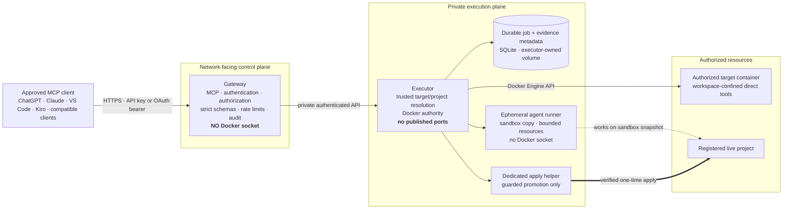
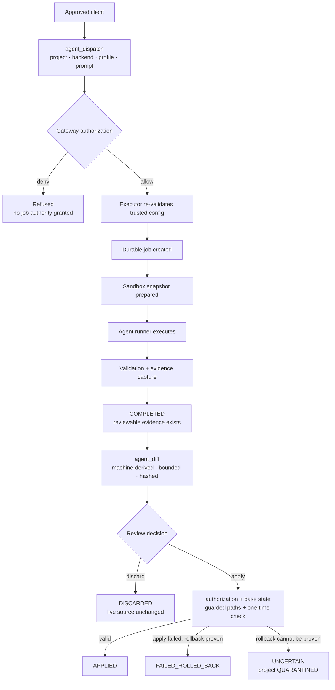
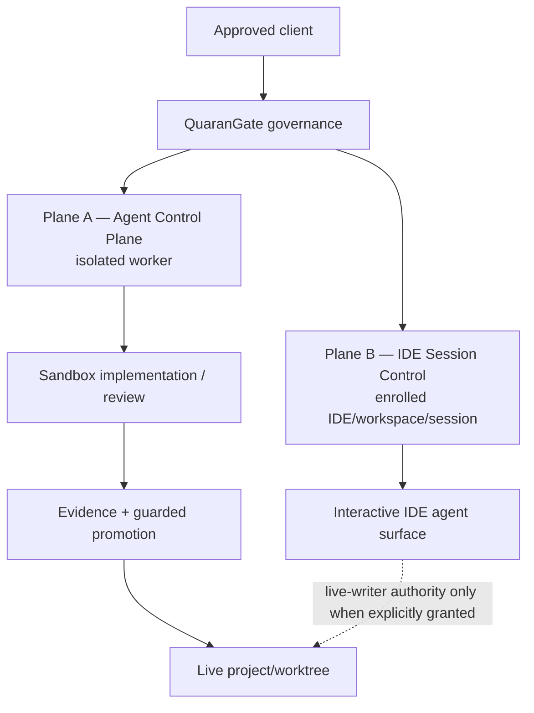

# QuaranGate

**Governed execution for AI coding agents.**

QuaranGate is a self-hosted engineering control plane that lets approved AI clients work against approved development environments without giving those clients unrestricted access to the host, the Docker API, or live project source by default.

It is built around a simple rule:

> **AI may investigate, implement, test and review. QuaranGate decides what it can reach, what authority it receives, what evidence it must produce, and what requires a separate approval before live source changes.**

QuaranGate currently provides two implemented execution surfaces:

- **Direct target operations** — governed file, terminal, Git and process operations inside explicitly authorized Docker targets.
- **Agent Control Plane** — asynchronous coding-agent work in isolated sandboxes, followed by machine-derived review evidence and a separate guarded apply or discard decision.

The approved North Star adds a third, separately authorized surface:

- **IDE Session Control Plane** — governed communication with an enrolled IDE agent surface bound to an exact IDE instance and workspace/worktree. This remains a design/qualification program, not current production capability.

> [!WARNING]
> The private `executor` service holds `/var/run/docker.sock`. Docker socket access is effectively host-level authority. QuaranGate deliberately keeps that authority away from the network-facing gateway, but it remains the system's highest-impact trust boundary. Read [Security](docs/SECURITY.md) before exposing QuaranGate beyond loopback.

---

## Contents

- [What QuaranGate does today](#what-quarangate-does-today)
- [What QuaranGate does not claim](#what-quarangate-does-not-claim)
- [Why QuaranGate exists](#why-quarangate-exists)
- [Design principles](#design-principles)
- [Current architecture](#current-architecture)
- [How governed agent work flows](#how-governed-agent-work-flows)
- [Security model](#security-model)
- [Authentication and credential handling](#authentication-and-credential-handling)
- [Targets, projects and authority](#targets-projects-and-authority)
- [Current MCP capabilities](#current-mcp-capabilities)
- [Local Ollama backend status](#local-ollama-backend-status)
- [IDE Session Control North Star](#ide-session-control-north-star)
- [Platform support](#platform-support)
- [Requirements and installation](#requirements-and-installation)
- [Build preparation in practice](#build-preparation-in-practice)
- [First use](#first-use)
- [Operational health](#operational-health)
- [Build reproducibility](#build-reproducibility)
- [Project status and roadmap](#project-status-and-roadmap)
- [Documentation](#documentation)
- [License](#license)

---

## Status language used in this repository

QuaranGate deliberately separates *implemented*, *qualified* and *planned*. These labels are used consistently throughout the user-facing documentation.

| Status | Meaning |
|---|---|
| **Available** | Implemented and accepted as part of the current system. |
| **Implemented — acceptance/deployment pending** | Source exists and its defined qualification has passed, but the current operational deployment gate is incomplete. |
| **Experimental / feasibility proven** | A spike or qualification proved an approach can work. It is not production capability. |
| **Roadmap / North Star** | Approved direction or design; not implemented. |
| **Not supported** | Deliberately unavailable or outside the current authority model. |

This distinction matters. A successful spike is not a production adapter. A qualified model is not the same thing as a deployed backend. A completed agent job is not the same thing as an applied source change.

Current accepted local source baseline for this documentation reconciliation:

```text
18179696b3ef3ff2192805590027d2e1a43a43d4
build: add governed offline npm dependency bundle
```

At that checkpoint: TypeScript typecheck PASS, **44/44 unit test files**, **1693/1693 unit tests**, normal source build PASS, and a no-cache Docker build PASS with build networking disabled and no image pull. The N1 commit was local-only at acceptance: it did not push, deploy, restart the live stack, or enable O1.

---

# What QuaranGate does today

QuaranGate is already a functioning MCP-to-development-environment control plane with a completed Agent Control Plane through Phase A6.

### Direct governed target operations

An authenticated client can, when explicitly granted the required scope and target:

- list and inspect authorized Docker targets;
- read, list, stat and fixed-string search files inside the authorized workspace;
- create, overwrite, patch or delete files when granted write/delete scopes;
- execute bounded shell commands inside the target workspace;
- inspect Git status, diff and log;
- inspect running processes;
- receive typed MCP results with structured output schemas.

The caller addresses a **logical target ID**. It does not choose arbitrary containers, host paths, bind mounts, Docker images or privilege flags.

### Governed coding-agent execution

The Agent Control Plane adds nine MCP operations:

```text
agents_list
agent_projects
agent_dispatch
agent_status
agent_result
agent_cancel
agent_diff
agent_apply
agent_discard
```

A real Kiro ACP backend is implemented. Write-capable agent work occurs against a sandbox copy, not the live project. QuaranGate captures evidence, exposes a machine-derived diff, and separates review from application.

The important boundary is:

```text
agent COMPLETED
      ≠
project APPLIED
```

A coding agent finishing successfully does not grant it authority over the real source tree.

### Evidence, recovery and retention

The implemented A6 lifecycle includes:

- durable SQLite job state on an executor-owned volume;
- machine-derived change evidence;
- bounded diff retrieval;
- base-state verification before apply;
- guarded path policy;
- one-time disposition;
- rollback proof;
- project quarantine when recovery cannot be proven;
- retained evidence lifecycle and automatic expiry of eligible physical evidence;
- durable metadata retained after physical evidence expires.

### Browser and client integration

The bridge has been exercised from real browser MCP clients, including ChatGPT and Claude, against authorized targets. Remote public ingress is operator-provided rather than silently enabled by QuaranGate.

---

# What QuaranGate does not claim

These boundaries are intentional and should be read as part of the product, not as missing marketing bullets.

| Capability | Current status |
|---|---|
| Arbitrary host shell | **Not supported** |
| Caller-supplied Docker mounts/images/network modes | **Not supported** |
| Raw Docker API exposed to MCP clients | **Not supported** |
| Automatic application of agent-generated changes | **Not supported** |
| Automatic cloud fallback | **Not supported** |
| GitHub Copilot production backend | **Roadmap — A7** |
| Session resume/continuity | **Roadmap — A8** |
| Full production hardening program | **Roadmap — A9** |
| Production IDE Session Control adapter | **Roadmap / qualification program** |
| macOS production acceptance | **Not yet verified** |
| Native Windows-without-WSL production acceptance | **Not claimed** |
| Fully empty-machine, zero-artifact, zero-network build | **Not possible by definition** |

QuaranGate also does **not** treat “local model” as synonymous with “no data leakage”. Inference location and network authority are separate controls. IDE extensions, package builds, provider adapters and other surrounding processes may still have network access unless they are independently constrained and qualified.

---

# Why QuaranGate exists

Giving an AI assistant useful engineering capability usually creates an uncomfortable trade-off:

```text
No machine authority
        ↓
AI cannot do meaningful work

or

Broad shell / Docker / workspace authority
        ↓
AI can work, but compromise and prompt injection have a large blast radius
```

QuaranGate inserts a deterministic control plane between the AI client and privileged execution.

The model can ask for an operation. **The model does not define the security boundary.**

Authority comes from code and configuration:

```text
authenticated principal
        ↓
required scope
        ↓
explicit target/project grant
        ↓
trusted backend/profile policy
        ↓
workspace and container confinement
        ↓
bounded execution
        ↓
evidence
        ↓
separate promotion authority
```

This is why QuaranGate is more than a remote shell wrapper. The useful capability is not merely “AI can run commands”. The useful capability is that the permitted action, target, evidence and promotion boundary are explicit and independently reviewable.

---

# Design principles

## Least authority

A component receives only the authority needed for its role.

The gateway can authenticate and authorize clients, but has no Docker socket. The executor owns Docker authority but is private and unpublished. Agent runners receive neither the Docker socket nor arbitrary host mounts.

**Why:** compromise of one trust zone should not automatically collapse every other boundary.

## Fail closed

Unknown target, missing scope, stale source, ambiguous Docker resolution, invalid artifact, uncertain rollback or missing evidence results in refusal rather than an inferred fallback.

**Why:** an automation control plane is most dangerous when it silently “does something reasonable” after its assumptions stop being true.

## Evidence before trust

QuaranGate does not treat an agent sentence such as “all tests pass” or “I changed only these files” as authoritative evidence.

Machine state, Git state, generated diffs, hashes and deterministic validation are used instead.

**Why:** agent output is a report, not proof.

## Generation is not promotion

Implementation occurs in a sandbox. Applying to real source is a different operation with different authority.

**Why:** the system should promote the artifact that was reviewed, not trust a second reconstruction of what the agent supposedly produced.

## Deterministic boundaries beat prompt instructions

Prompts can tell an agent “do not read secrets”. QuaranGate still removes secret paths and host authority from the agent's reachable environment.

**Why:** security cannot depend on a model continuing to obey prose after prompt injection or tool confusion.

## One controlled live writer

Many readers and isolated workers may exist, but live source mutation is serialized at the project/worktree boundary.

**Why:** parallel reasoning is useful; competing uncontrolled writers against one worktree are not.

## Local does not automatically mean private

A local Ollama model may keep inference on the workstation while the IDE, build tooling, extensions or other processes still communicate externally.

**Why:** data-leakage analysis has to follow every process with network authority, not only the model endpoint.

## Historical evidence stays historical

Frozen audit records are not rewritten to make old milestones look current.

**Why:** an audit trail is useful only if it records what was actually observed at that time.

---

# Current architecture

The implemented runtime separates the network-facing MCP boundary from Docker authority.



### Why split gateway and executor?

The gateway is the component that may face an external network. The executor is the component that needs Docker authority. Combining those roles would make a network compromise much more dangerous.

The split does **not** make the executor harmless. An executor RCE or Docker daemon/kernel vulnerability remains high impact. It reduces exposed authority; it does not erase the underlying Docker trust risk.

See [Architecture](docs/ARCHITECTURE.md) for the detailed request flows and trust zones.

---

# How governed agent work flows

The implemented lifecycle is intentionally multi-step.



### Why does `agent_apply` take no caller-supplied patch?

The apply operation promotes stored, verified job evidence. The caller cannot submit a different patch at promotion time.

**Why:** review and apply must refer to the same artifact.

### Why quarantine uncertain recovery?

If an apply fails and QuaranGate cannot prove the live project returned to its original state, it records the outcome as uncertain and blocks further applies.

**Why:** ambiguous state is not success. Continuing automatically could compound damage.

---

# Security model

QuaranGate's security design is not one feature. It is a series of independent boundaries.

## Credential hashing

Static client API keys are generated with high entropy and only their **SHA-256 hash** is stored in client configuration.

```text
raw client key
     ↓
shown to operator
     ↓
SHA-256
     ↓
keyHash stored
```

The raw reusable credential is not meant to be persisted in the repository.

**Why:** disclosure of `config/clients.yaml` should not automatically expose the original reusable API keys.

**Limit:** hashing does not make a stolen live key safe. A disclosed raw credential must still be rotated/revoked.

## Per-client principals

Each client maps to its own principal with its own scopes and allowlists.

**Why:** one compromised client should be revocable without replacing every other client's credential, and its authority should be bounded to its own grants.

## Deny-by-default authorization

Missing grants mean no authority. Target permission does not imply agent permission. Agent permission does not imply IDE Session Control permission.

**Why:** capabilities should be deliberately granted, not inferred from adjacent access.

## OAuth 2.1 + PKCE S256

Browser clients that require OAuth use a small authorization façade with Dynamic Client Registration, exact redirect matching, PKCE S256, resource binding, single-use authorization codes and rotating refresh tokens.

**Why:** the browser path needs standards-compatible delegated authorization without weakening the underlying principal model.

## Gateway / executor privilege split

The gateway has no Docker socket. The executor is unpublished and reachable only through the private internal service path.

**Why:** the process that accepts external MCP traffic should not directly hold Docker's root-equivalent control channel.

## Workspace confinement

Path inputs are validated and canonicalized inside the target. Absolute paths, traversal and symlink escapes are rejected.

**Why:** a permitted filesystem tool should not become a way to escape the approved workspace.

## Sandbox-first implementation

Write-capable coding agents receive a sandbox copy instead of a normal read/write mount of the live project.

**Why:** model-generated work remains reviewable before it can become live source.

## Guarded paths and stale-state protection

Apply checks the current source state against the job's recorded base and evaluates configured guarded paths before promotion.

**Why:** a patch reviewed against one repository state should not be silently applied after that state has changed, and sensitive paths should require stronger policy.

## Bounded output and runtime

Terminal and agent execution have time, output and resource bounds.

**Why:** accidental or malicious runaway behavior should have deterministic limits.

## Audit evidence

Important calls are attributed to a principal, operation and target/job. Sensitive bodies are not blindly logged.

**Why:** incident investigation and engineering acceptance should not depend on model memory.

See [Security](docs/SECURITY.md) for the complete threat model and residual risks.

---

# Authentication and credential handling

QuaranGate supports two client authentication paths that resolve to the same principal/authorization model.

### Static API keys

Generated per client. Only the SHA-256 `keyHash` is stored in the normal committed configuration workflow.

Typical lifecycle:

```text
generate
  ↓
store raw key in the client
  ↓
store hash in QuaranGate config
  ↓
rotate/revoke per client when required
```

### OAuth 2.1

Used for clients that require browser OAuth. The current façade includes:

- protected-resource metadata;
- authorization-server metadata;
- JSON Dynamic Client Registration;
- authorization code flow;
- PKCE S256;
- exact redirect URI validation;
- MCP resource binding;
- single-use authorization codes;
- rotating refresh tokens;
- hashed persisted OAuth state.

A browser bearer maps back to the same QuaranGate principal as the underlying client identity. OAuth does not bypass the scope/target/project checks.

### Secret rule

Credentials, API tokens and provider keys should never be:

- committed to Git;
- returned in MCP result objects;
- printed in audit logs;
- copied into documentation examples as real values;
- shared across unrelated backends without a demonstrated need.

---

# Targets, projects and authority

QuaranGate uses two related but different resource models.

## Targets

Targets are authorized Docker containers used by the direct file/terminal/Git/process tool surface.

A target can be configured manually or discovered through explicit opt-in labels. Discovery does not grant authority; the calling principal must still be allowed to use the target ID.

## Agent projects

Agent projects are trusted executor-side registrations of real source repositories.

The caller supplies a logical project ID such as:

```text
mcp-ide-bridge
```

not:

```text
/home/herman/projects/mcp-ide-bridge
```

The host path, allowed backends, profiles, resource policy and guarded paths live in trusted configuration.

**Why:** a remote caller should not be able to invent a new host filesystem mount by changing an MCP argument.

See [Targets](docs/TARGETS.md) and [Agent Control Plane](docs/AGENT_CONTROL_PLANE.md).

---

# Current MCP capabilities

The current operational surface contains **23 tools**: the original direct-operation tools plus all nine Agent Control Plane tools.

## Direct target tools

| Tool | Authority | Purpose |
|---|---|---|
| `targets_list` | read | List targets visible to the principal. |
| `target_inspect` | read | Inspect authorized target status/workspace/image metadata. |
| `fs_list` | read | List workspace content. |
| `fs_stat` | read | Inspect a workspace path. |
| `fs_read` | read | Read bounded file content. |
| `fs_search` | read | Fixed-string search with result bounds. |
| `fs_write` | write | Create/overwrite a file. |
| `fs_patch` | write | Deterministic exact-text replacement. |
| `fs_delete` | destructive | Delete a file/directory when explicitly authorized. |
| `terminal_exec` | execution | Run a bounded shell command inside the target workspace. |
| `git_status` | read | Git working-state inspection. |
| `git_diff` | read | Git diff inspection. |
| `git_log` | read | Git history inspection. |
| `process_list` | read | Inspect processes in the target. |

## Agent Control Plane tools

| Tool | Purpose |
|---|---|
| `agents_list` | Show backends/profiles the principal may use. |
| `agent_projects` | Show logical agent projects visible to the principal. |
| `agent_dispatch` | Create an asynchronous governed job. |
| `agent_status` | Read lifecycle state. |
| `agent_result` | Read normalized completion/failure evidence. |
| `agent_cancel` | Cancel an authorized active job. |
| `agent_diff` | Retrieve bounded machine-derived change evidence. |
| `agent_apply` | Promote stored verified evidence under guarded checks. |
| `agent_discard` | Reject the result without modifying live source. |

---

# Local Ollama backend status

O1 adds a governed local Ollama backend for bounded **read-only** audit/plan/review work.

Current accepted model qualification:

| Role | Model | Status |
|---|---|---|
| Primary | `qwen3.5:4b-q4_K_M` | Qualified and owner-selected |
| Capacity reserve | `qwen3.5:9b-q4_K_M` | Qualified |
| Alternate | `ministral-3:8b-instruct-2512-q4_K_M` | Qualified |
| Gemma 4 12B | deferred | Host Ollama version was too old for qualification; not classified as model failure |

The important status boundary is:

> **The O1 source implementation and model selection are complete, but controlled container deployment and post-deploy acceptance are separate gates.**

Do not interpret “qualified model” as “backend fully deployed in production”.

No automatic model fallback and no cloud fallback are part of the approved O1 design.

See [O1 Model Qualification](docs/O1_MODEL_QUALIFICATION.md).

---

# IDE Session Control North Star

The Agent Control Plane works in isolated sandboxes. The North Star adds a complementary IDE plane for controlled interaction with an active IDE agent surface.



These planes do not silently inherit each other's authority.

Required IDE targets in the approved program:

- Kiro;
- VS Code;
- Cursor.

Secondary feasibility targets:

- Visual Studio;
- Antigravity.

A VS Code Chat Participant spike has proven one public-API architecture feasible. That evidence does **not** mean a production adapter exists, and it does not prove Kiro/Cursor integration.

See [IDE Session Control](docs/IDE_SESSION_CONTROL.md) and the frozen S1 qualification record.

---

# Platform support

QuaranGate is being designed so the operator-facing workflow does not depend on one developer's home path or one desktop operating system.

| Platform | Design target | Current verification |
|---|---|---|
| Linux + Docker | Yes | Core container architecture is Linux-native; dedicated platform acceptance should accompany release claims. |
| Windows 11 + WSL2 + Docker Desktop | Yes | **Current primary development/qualification environment.** |
| macOS + Docker Desktop | Yes | **Design-compatible; production qualification still required.** |
| Native Windows containers / no WSL2 | Not a current production target | Not claimed. |

Cross-platform design means host-specific locations should be operator inputs, while Docker-side paths remain stable. It does **not** mean every platform is already verified.

---

# Requirements and installation

The current implementation is built around:

- Git;
- Node.js 22+ / current Node 24 development baseline;
- Docker Engine or Docker Desktop with Compose;
- Linux containers;
- a configured Docker target/project environment;
- operator-created QuaranGate client/config secrets.

### Windows 11

Use **WSL2 Ubuntu** for repository and shell operations. Run project commands inside the WSL terminal, not PowerShell, unless a command is explicitly documented as a Windows-side step.

### Linux

Use a normal shell in the repository. Ensure the user running QuaranGate can access Docker according to the deployment procedure.

### macOS

The intended deployment model is Docker Desktop with Linux containers. The current documentation will not label macOS verified until the full install/build/acceptance path has been exercised there.

> [!IMPORTANT]
> QuaranGate source builds now use a governed, lockfile-scoped npm dependency bundle. Dependency acquisition is a separate controlled step; the build that sees QuaranGate source runs with networking disabled. A fresh offline machine still needs pre-provisioned inputs such as the source checkout, the approved npm bundle, and required base image layers.

---

## Build preparation in practice

The normal build path requires a verified dependency bundle. On the current workstation an operator-selected artifact root may be:

```bash
export QUARANGATE_NPM_ARTIFACT_ROOT="$HOME/.local/share/quarangate/build-artifacts/npm"
```

If dependency artifacts have not yet been prepared, run the controlled source-free preparation step. It uses the already-local `node:24-alpine` image with `--pull=never`; only `package.json`, `package-lock.json`, the preparation tool and the artifact output directory are exposed to that networked container.

```bash
node scripts/npm-offline-bundle.mjs prepare \
  --artifact-root "$QUARANGATE_NPM_ARTIFACT_ROOT"
```

Resolve and verify the exact lock-scoped bundle:

```bash
export QUARANGATE_NPM_BUNDLE_PATH="$(node scripts/npm-offline-bundle.mjs print-path \
  --artifact-root "$QUARANGATE_NPM_ARTIFACT_ROOT")"

node scripts/npm-offline-bundle.mjs verify \
  --bundle "$QUARANGATE_NPM_BUNDLE_PATH" \
  --descriptor build/npm-dependencies.json
```

Then build with Compose. The Compose/Dockerfile policy keeps the source build network at `none` and sets `pull: false`:

```bash
export GIT_REVISION="$(git rev-parse HEAD)"
export GATEWAY_IMAGE="quarangate:gateway-$GIT_REVISION"
export EXECUTOR_IMAGE="quarangate:executor-$GIT_REVISION"
docker compose build
```

If `QUARANGATE_NPM_BUNDLE_PATH` is unset, ordinary runtime Compose commands still parse normally. A source build falls back to the repository `build/` sentinel context and fails closed in the bundle verifier before npm runs.

See [Operations](docs/OPERATIONS.md) for the complete online-bootstrap versus pre-provisioned-offline procedures.

---

# First use

At a high level, a new operator must:

1. clone QuaranGate;
2. create `.env` from its example;
3. create `config/bridge.yaml` from the committed example;
4. create `config/clients.yaml` and generate a separate client key;
5. optionally create `config/agents.yaml` to enable the Agent Control Plane;
6. build/start the bridge using the accepted build procedure;
7. verify `/healthz` and `/readyz`;
8. connect an MCP client;
9. verify target discovery before granting write/agent scopes.

The detailed, copy-pasteable per-platform procedure belongs in [Operations](docs/OPERATIONS.md) and [Client Setup](docs/CLIENT_SETUP.md). Those documents distinguish commands run in WSL/Linux/macOS from browser/client configuration steps.

---

# Operational health

QuaranGate exposes two deliberately different probes.

### `/healthz` — liveness

Answers the question:

> Is the gateway process alive?

It deliberately does not depend on client configuration or executor reachability.

### `/readyz` — readiness

Answers the question:

> Is the gateway actually ready to authenticate clients and reach the executor?

Readiness fails closed if critical configuration or executor reachability is unavailable.

**Why split them?** A process can be alive while being unusable. Treating liveness as readiness could report a broken deployment as healthy.

---

# Build reproducibility

QuaranGate's build process is being hardened so external dependency acquisition is separated from the real source build.

One completed improvement is the Tini runtime dependency:

- Tini `0.19.0` is preserved under `third_party/tini/0.19.0/`;
- its exact binary SHA-256 is recorded and checked during the image build;
- its MIT license and provenance are preserved;
- the Dockerfile no longer needs `apk add tini` from an external Alpine repository.

**Why:** a production build should not silently replace a reviewed runtime binary with whatever package a mutable repository returns later.

This is intentionally an upgradeable pin, not a permanent ban on newer Tini versions. A future upgrade should be explicit, reviewed and re-qualified.

The npm build dependency was closed by N1 at commit `18179696b3ef3ff2192805590027d2e1a43a43d4`. QuaranGate now separates dependency acquisition from source compilation:

```text
CONTROLLED PREPARATION
package.json + package-lock.json + preparation tool
        |
        | exact registry.npmjs.org tarball URLs only
        | SHA-512 verification
        v
lock-scoped external bundle
        |
        v
REAL SOURCE BUILD
BuildKit named context (read-only)
network = none
fresh tmpfs npm cache
npm ci --offline --ignore-scripts
```

N1 independently proved a `--no-cache --network=none --pull=false` Docker build using the canonical unchanged `package-lock.json`. The final runtime image contains neither the dependency bundle nor the temporary npm cache.

This is deliberately **not** the same as claiming that a completely empty machine can build with zero network and zero supplied artifacts. Offline reproduction still requires the approved source, base image layers and verified dependency bundle to be available locally. The current Dockerfile also uses the mutable tag `node:24-alpine`; current-machine offline input identity was verified, while cross-machine bit-for-bit base-image reproducibility remains a separate hardening item.

---

# Project status and roadmap

## Agent Control Plane

| Gate | Scope | Status |
|---|---|---|
| A0 | Forensic readiness | ✅ Complete |
| A1 | Contracts, scopes, state machine | ✅ Complete |
| A2 | Durable job engine + deterministic fake backend | ✅ Complete |
| A3 | Isolated runner sandbox | ✅ Complete |
| A4 | Kiro ACP read-only backend | ✅ Complete |
| A5 | Kiro sandbox implementation | ✅ Complete |
| A6 | Diff / guarded apply / discard + evidence lifecycle | ✅ Complete |
| A7 | GitHub Copilot backend | ⏭️ Next formal A-gate |
| A8 | Session continuity | 📋 Not started |
| A9 | Production hardening + complete E2E | 📋 Not started |

## Parallel current programs

### O1 — governed Ollama backend

Source implementation and model qualification are complete. The N1 source-build reproducibility remediation is also complete. Controlled O1 container canary/deployment, runtime resource qualification and post-enable MCP acceptance remain separate gates; O1 is not production-enabled by the documentation work.

### I0–I6 — IDE Session Control

Approved North-Star program. VS Code Architecture B feasibility has been proven by S1, but no production IDE Session Control adapter is claimed.

---

# Documentation

| Document | Purpose |
|---|---|
| [Master PRD](MCP_IDE_BRIDGE_MASTER_PRD.md) | Canonical product decisions, current status, roadmap and decision history. |
| [Architecture](docs/ARCHITECTURE.md) | Implemented components, trust zones, flows and separate North-Star architecture. |
| [Security](docs/SECURITY.md) | Security objectives, design decisions, threat model, evidence and residual risks. |
| [Agent Control Plane](docs/AGENT_CONTROL_PLANE.md) | Exact agent contracts, lifecycle, policy and apply semantics. |
| [IDE Session Control](docs/IDE_SESSION_CONTROL.md) | Approved I0 authority model and IDE-adapter program. |
| [Targets](docs/TARGETS.md) | Target discovery, authorization and shipped target lanes. |
| [Client Setup](docs/CLIENT_SETUP.md) | Client-specific connection/authentication instructions. |
| [Operations](docs/OPERATIONS.md) | Build, run, validate, credentials, health, backup and troubleshooting. |
| [Compatibility](docs/COMPATIBILITY.md) | Protocol/client compatibility evidence and external references. |
| [Test Results](docs/TEST_RESULTS.md) | Current verified baseline followed by historical milestone evidence. |
| [O1 Model Qualification](docs/O1_MODEL_QUALIFICATION.md) | Ollama model qualification, limitations and activation boundary. |
| `docs/audits/` | Frozen historical evidence. These records are not rewritten to make old results look current. |
| [PLAN.md](PLAN.md) | Original executed implementation plan. Historical, not the current roadmap authority. |

---

# Naming and compatibility

**QuaranGate** is the canonical current product identity. Some internal runtime identifiers intentionally retain older `mcp-ide-bridge` / `mcp-bridge` names where a blind rename would risk persistent state, evidence discovery or rollback compatibility.

This is intentional technical debt with a controlled migration contract, not uncertainty about the product name.

Security credential prefixes such as `mcpb_` are compatibility identifiers and are not branding targets.

See the Master PRD identity-migration section for the full decision register.

---

# License

QuaranGate is licensed under the MIT License. See [LICENSE](LICENSE).

`package.json` is marked `private` to prevent accidental npm publication. That publishing safeguard does not replace or narrow the repository's MIT license grant.
