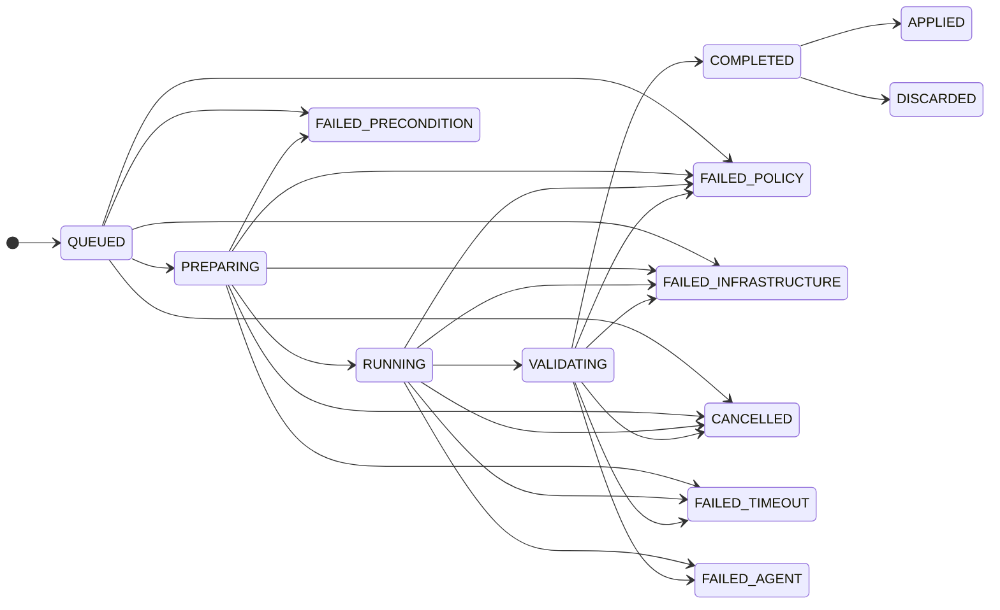
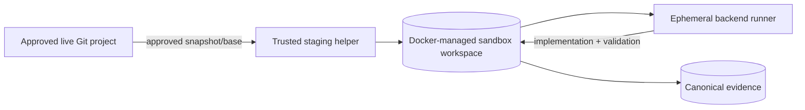

# Agent Control Plane

**Status:** A0-A6 complete. The full nine-tool Agent Control Plane is implemented with a real Kiro ACP backend, sandboxed write capability, machine-derived review evidence, guarded apply/discard and retained-resource lifecycle.

This document is the code-adjacent explanation of how QuaranGate governs coding-agent work. The Master PRD remains the product/roadmap authority; source and tests remain the evidence for exact implementation behavior.

---

## Contents

- [Purpose](#purpose)
- [Why an Agent Control Plane exists](#why-an-agent-control-plane-exists)
- [Current operational tools](#current-operational-tools)
- [Authority model](#authority-model)
- [Projects and trusted configuration](#projects-and-trusted-configuration)
- [Profiles](#profiles)
- [Resource policies](#resource-policies)
- [Job lifecycle](#job-lifecycle)
- [Dispatch and persistence](#dispatch-and-persistence)
- [Sandbox execution](#sandbox-execution)
- [Kiro backend](#kiro-backend)
- [Result and evidence](#result-and-evidence)
- [Diff](#diff)
- [Apply](#apply)
- [Discard](#discard)
- [Rollback, uncertainty and quarantine](#rollback-uncertainty-and-quarantine)
- [Retention and cleanup](#retention-and-cleanup)
- [Writer policy and concurrency](#writer-policy-and-concurrency)
- [Network policy](#network-policy)
- [Secrets](#secrets)
- [Failure model](#failure-model)
- [What is not implemented yet](#what-is-not-implemented-yet)
- [Security invariants](#security-invariants)

---

# Purpose

The Agent Control Plane removes the manual clipboard loop between an engineering lead/client and a coding agent while preserving the review and approval boundary.

The target workflow is:

```text
discuss task
   ↓
approve bounded scope
   ↓
agent_dispatch
   ↓
isolated implementation
   ↓
validation + evidence
   ↓
agent_diff
   ↓
independent review
   ↓
apply OR discard
```

The important product decision is that **agent execution and project promotion are separate authorities**.

---

# Why an Agent Control Plane exists

A simple remote-agent integration could do this:

```text
client
  ↓
agent with live RW project
  ↓
agent changes source directly
```

QuaranGate deliberately does not use that as the normal model.

The implemented control plane instead provides:

```text
client intent
   ↓
server-side authorization
   ↓
durable job
   ↓
sandbox snapshot
   ↓
agent work
   ↓
machine evidence
   ↓
separate promotion decision
```

### Why?

Because an AI worker is useful precisely when it can make non-trivial decisions. That same flexibility makes it a poor place to put the final security boundary.

The control plane keeps useful autonomy while making the critical authority transitions deterministic and reviewable.

---

# Current operational tools

All nine tools are registered and operational.

| Tool | Scope | Purpose |
|---|---|---|
| `agents_list` | `agents:read` | Discover backends/profiles visible to the principal. |
| `agent_projects` | `agents:read` | Discover logical projects visible to the principal. |
| `agent_dispatch` | `agents:dispatch` | Create a governed asynchronous job. |
| `agent_status` | `agents:read` | Read current lifecycle state. |
| `agent_result` | `agents:read` | Read normalized result/failure metadata. |
| `agent_cancel` | `agents:cancel` | Cancel a permitted active job. |
| `agent_diff` | `agents:read` | Retrieve bounded machine-derived change evidence. |
| `agent_apply` | `agents:apply` | Promote stored verified evidence to the live project. |
| `agent_discard` | `agents:dispatch` | Reject completed work without touching live source. |

The direct target tool surface and the Agent Control Plane are independent. A principal with filesystem/terminal access does not automatically receive agent authority.

---

# Authority model

Agent authorization considers more than one scope bit.

```text
principal
   ↓
required agents:* scope
   ↓
project grant
   ↓
backend grant
   ↓
profile grant
   ↓
job ownership where relevant
```

Missing grant means **deny**.

## Scopes

```text
agents:read
agents:dispatch
agents:cancel
agents:apply
```

## Job ownership

Status/result/cancel/diff/apply/discard operations are tied to the job's owning principal.

There is no normal cross-principal administrative override in the v1 contract.

## Why `agent_apply` has separate authority

A caller may be trusted to ask an agent to investigate or implement in a sandbox while still being untrusted to modify the real project.

This is why `agents:dispatch` and `agents:apply` are different scopes.

---

# Projects and trusted configuration

Clients address **logical project IDs**.

Example public input:

```json
{
  "project": "mcp-ide-bridge",
  "backend": "kiro",
  "profile": "implement"
}
```

The caller does not provide:

```text
hostPath
Docker bind source
runner image
network mode
privileged flag
docker.sock
```

Those values belong to trusted executor configuration.

## Why project IDs instead of host paths?

If a remote caller could submit:

```text
/home/herman
```

or:

```text
/
```

as the project mount, the project registry would not be a security boundary.

Logical IDs let the executor map a public identifier to an already-approved source and policy.

## Trusted project policy

A project record may define:

- trusted host path;
- Git requirement;
- allowed backends;
- allowed profiles;
- guarded paths;
- default resource/network/retention policy.

These values are not caller-controlled.

---

# Profiles

Profiles are **enforcement policies**, not personas.

Current policy model includes:

## `audit`

Typical authority:

```text
workspace: read-only
Git: read
shell: none/read-oriented according to configured policy
network: deny or backend-only only when required
```

Use for forensic inspection, diagnosis and architecture review.

## `plan`

Read-oriented planning without source mutation.

## `implement`

Sandbox-write authority with bounded validation capability.

Important:

> `implement` means **write the sandbox**, not “write the live project”.

## `review`

Independent read-oriented inspection/validation of source or job evidence.

---

# Resource policies

QuaranGate keeps resource policy explicit rather than leaving the provider/runner to consume arbitrary resources.

Named policy classes include:

```text
economy
standard
deep
```

Policy fields can govern:

- model class;
- maximum runtime;
- CPU allocation;
- memory;
- PID count;
- output bytes;
- evidence bytes;
- optional provider credit limit where meaningful;
- network policy;
- retention class.

Integer units are used where practical to avoid ambiguous floating-point resource interpretation.

## Why provider-neutral model classes?

The public control plane should not need to encode one vendor's exact model identifiers into the generic job contract. Backend adapters resolve the approved concrete model/configuration.

That also makes future backend support additive rather than requiring a new MCP contract per provider.

---

# Job lifecycle

The persisted job state machine distinguishes active execution, terminal failure and post-completion disposition.



The failure classes remain distinct because they mean different things operationally.

## Critical invariant

```text
COMPLETED != APPLIED
```

`COMPLETED` means the job has reached a reviewable terminal execution state with evidence.

`APPLIED` means a separate authorized promotion succeeded.

## Retry semantics

A failed terminal job does not mutate back into an active one. A retry is a new job with a new identity.

### Why?

Historical job state is evidence. Reusing the same persisted record for a different attempt would blur what actually happened.

---

# Dispatch and persistence

`agent_dispatch` creates an asynchronous job and returns a job ID rather than holding one MCP request open for the entire coding session.

Conceptually:

```text
agent_dispatch
     ↓
authorize
     ↓
executor validates trusted config
     ↓
persist QUEUED job
     ↓
return jobId
     ↓
background lifecycle continues
```

## Persistence

The executor owns the durable SQLite job store on its persistent jobs volume.

This allows QuaranGate to retain job identity and state across client disconnects and expected service lifecycle events.

## Why not store the job only in the browser/client?

The privileged execution facts need to remain knowable even if the caller disconnects.

A running Docker worker must not become an orphan merely because an MCP transport disappeared.

## Restart safety

Recovery logic treats previously active jobs conservatively rather than silently resuming them as though no interruption occurred.

Writer admission is persisted so restart does not accidentally create a second writer against the same policy boundary.

---

# Sandbox execution

The normal write-capable agent does not receive the live project as a generic read/write bind.

The execution model is:



## Runner hardening

The implemented runner model includes:

- non-root worker identity;
- non-privileged container;
- capability drop;
- no-new-privileges;
- read-only root filesystem;
- sandbox volume as the deliberate writable project area;
- no Docker socket;
- no arbitrary host bind;
- resource/time/output limits;
- backend-specific/deny network policy rather than ordinary unrestricted egress.

## Why copy the project?

It creates a stable review boundary:

```text
live source before job
        ↓
controlled snapshot
        ↓
agent changes sandbox
        ↓
exact changed artifact
```

The real project remains unchanged until the separate apply operation.

---

# Kiro backend

Kiro ACP is the implemented real worker backend.

The adapter uses a machine-facing ACP process/session flow rather than GUI automation.

The backend is intentionally isolated from the user's normal interactive Kiro environment where practical, including dedicated automation credentials/state.

## Why ACP instead of clicking the IDE?

Window focus, keyboard injection and pixel scraping are brittle automation techniques and cannot serve as a reliable security boundary.

A supported machine-facing protocol gives QuaranGate structured lifecycle and cancellation behavior that can be normalized behind the backend adapter.

## Current backend status

Kiro is the real implemented Agent Control Plane backend.

A non-Kiro/fake path exists for deterministic testing and must not be described as a production AI backend.

GitHub Copilot remains the next formal backend gate (A7).

---

# Result and evidence

`agent_result` returns a normalized, bounded summary of what happened.

It is not intended to dump every raw transcript/tool event into one response.

Evidence may include references/hashes/metadata for larger retained artifacts.

## Prompt handling

The raw bounded prompt is stored on the executor side for job execution/recovery needs, while audit/log records use prompt identity/hash rather than indiscriminately copying the whole prompt into logs.

## Usage reporting

If provider usage is unavailable, QuaranGate should report that honestly rather than inventing zero-cost/zero-token data.

Provider credit units are not assumed to be economically comparable between backends.

---

# Diff

`agent_diff` is the review surface for machine-derived code change evidence.

Properties include:

- derived from stored job evidence;
- exact changed-file status;
- bounded response size;
- cursor/paging behavior for large results;
- full-diff integrity hash;
- no dependence on the agent accurately describing its own modifications.

## Why not trust the model's summary?

An agent can accidentally omit a file, misunderstand a generated binary or simply be wrong.

The diff is derived from the artifact QuaranGate captured, not from the model's confidence.

---

# Apply

`agent_apply` is the controlled bridge from reviewed sandbox evidence to live source.

It takes **no arbitrary patch body from the caller**.

Required checks include:

```text
principal owns job
        ↓
principal has agents:apply
        ↓
project still granted
        ↓
job is COMPLETED and undisposed
        ↓
stored evidence available + valid
        ↓
live source matches required base policy
        ↓
guarded paths allowed
        ↓
patch/application preflight passes
        ↓
dedicated apply attempt
```

## Why no caller-supplied patch?

The artifact approved during review should be the artifact promoted during apply.

Allowing the caller to replace it with new patch text would break the evidence chain.

## Base-state verification

A job is created against a known source state. If the live project changes incompatibly before apply, the old evidence is stale.

QuaranGate refuses rather than auto-merging/guessing in the normal v1 apply path.

## Guarded paths

Project configuration can protect sensitive paths from normal apply authority.

The guard is enforced as policy, not merely as an instruction in the agent prompt.

---

# Discard

`agent_discard` records that completed work was rejected.

The live project remains untouched.

Discard does not need to pretend every physical evidence byte disappears immediately. The retention system owns expiry according to policy.

## Why separate logical disposition from physical deletion?

Audit/recovery evidence can remain useful after the engineering decision to reject the patch.

Deleting proof at the exact moment of rejection would couple two unrelated decisions:

```text
Should this change be applied?
```

and:

```text
How long should evidence be retained?
```

---

# Rollback, uncertainty and quarantine

Apply attempts have their own durable evidence/recovery semantics.

If apply fails:

```text
attempt rollback
      ↓
prove resulting state
```

If QuaranGate can prove the source returned to the expected state, the failure can be classified safely.

If it cannot prove rollback:

```text
UNCERTAIN
   ↓
project QUARANTINED
```

## Why quarantine?

Continuing to apply new work on top of unknown live state risks turning one ambiguous failure into multiple compounded mutations.

Quarantine forces explicit investigation/recovery.

There is no normal MCP operation that simply clears quarantine because the model asks to continue.

---

# Retention and cleanup

A6 separates job metadata from physical evidence lifecycle.

## Lane A — completed disposition evidence

Eligible evidence associated with applied/discarded jobs may expire after its retention period once fail-closed eligibility checks pass.

Durable metadata remains.

## Lane B — incomplete/orphan evidence

Incomplete evidence is identified, classified and retained conservatively rather than automatically deleted merely because it does not look normal.

## Why fail closed on cleanup?

Deleting an unknown Docker volume or artifact is itself a destructive action.

Cleanup must prove ownership/eligibility rather than infer it from a vague name match.

## Startup ordering

Lifecycle reconciliation occurs before normal service availability so active agent operations do not race with startup cleanup/classification.

---

# Writer policy and concurrency

The v1 writer policy was deliberately strict:

```text
maximum active global writer jobs      = 1
maximum active writer jobs per project = 1
```

The broader North-Star invariant is:

```text
many readers
many isolated workers
one controlled live writer per project/worktree
```

## Why distinguish sandbox writers from live writers?

Two isolated workspaces can potentially evolve independently without corrupting each other.

Two uncontrolled operations mutating the same real worktree cannot.

Future concurrency may expand isolated parallelism, but apply and future live IDE mutation must share a live-writer arbitration boundary.

---

# Network policy

Agent network access is a separate policy dimension from public MCP ingress.

Current ordinary network-policy values are intentionally constrained:

```text
deny
backend-only
```

There is no normal `unrestricted` profile setting.

## Why?

A coding worker normally needs either no network or the exact provider/backend connectivity required for its job. Broad arbitrary egress increases both data-leakage and supply-chain risk.

## Tailscale/host networking

Host ingress/operations configuration is outside the agent capability plane.

Normal agent work must not be allowed to execute host-level `tailscale serve`, `tailscale funnel` or tailnet policy changes merely because those tools exist on the workstation.

---

# Secrets

Provider credentials are runtime secrets, not job arguments.

Rules:

- do not commit them;
- do not return them in MCP results;
- do not expose every backend credential to every runner;
- do not deliberately place raw values in audit logs;
- isolate backend credentials so a Kiro job does not automatically receive future Copilot credentials.

Agent configuration files in Git are examples only; live secrets/config are separately managed.

---

# Failure model

QuaranGate keeps failure classes distinct so operators and clients know what type of problem occurred.

Examples:

| Failure | Meaning |
|---|---|
| `FAILED_PRECONDITION` | Required source/environment condition was not satisfied. |
| `FAILED_POLICY` | Security/authorization/profile policy refused the operation. |
| `FAILED_AGENT` | Backend/agent execution failed. |
| `FAILED_TIMEOUT` | Bounded execution exceeded its time limit. |
| `FAILED_INFRASTRUCTURE` | Executor/runner/persistence infrastructure failed. |
| `CANCELLED` | Authorized cancellation terminated the job. |

A generic “ERROR” would throw away useful recovery information.

---

# What is not implemented yet

## A7 — GitHub Copilot backend

The public contract is already backend-neutral, but Copilot is not a real production worker yet.

A7 must choose the then-current supported programmatic interface based on structured events, cancellation, session behavior, permission control and maintenance/security properties.

## A8 — Session continuity

The contract can represent session policy, but intentional backend-session resume is not current production behavior.

Session memory will not become an authorization mechanism when implemented.

## A9 — Production hardening and complete E2E

The final production-hardening gate remains open.

## O1 — governed Ollama backend

O1 is a parallel backend milestone for bounded read-only local-model work. Source/model qualification status is documented separately and should not be confused with A7 or Kiro's current production role.

## IDE Session Control

A separately authorized North-Star plane is being designed/qualified for live IDE agent interaction. It is not part of current Agent Control Plane authority and must not inherit it implicitly.

---

# Security invariants

Future Agent Control Plane work must preserve these rules unless the owner explicitly approves an architecture change:

```text
gateway has no Docker socket
executor remains unpublished
runner has no Docker socket
caller cannot provide host path or Docker privilege options
missing agent grants deny
agent work is sandbox-first
COMPLETED does not mean APPLIED
agent_apply accepts stored evidence, not arbitrary caller patch text
stale source refuses apply
guarded paths remain enforceable
uncertain rollback becomes explicit unsafe state/quarantine
secrets stay out of Git/results/audit wherever designed
one controlled live writer remains the promotion boundary
```

The purpose of the Agent Control Plane is not simply to automate coding. It is to make coding-agent authority **bounded, observable and reversible enough to review before promotion**.
