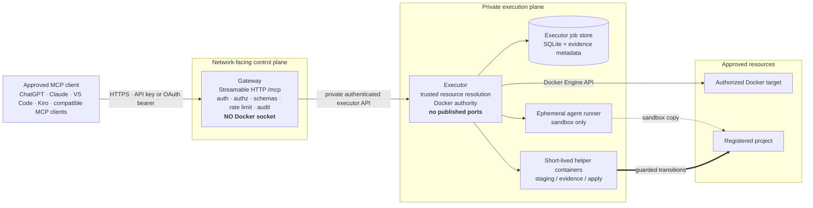
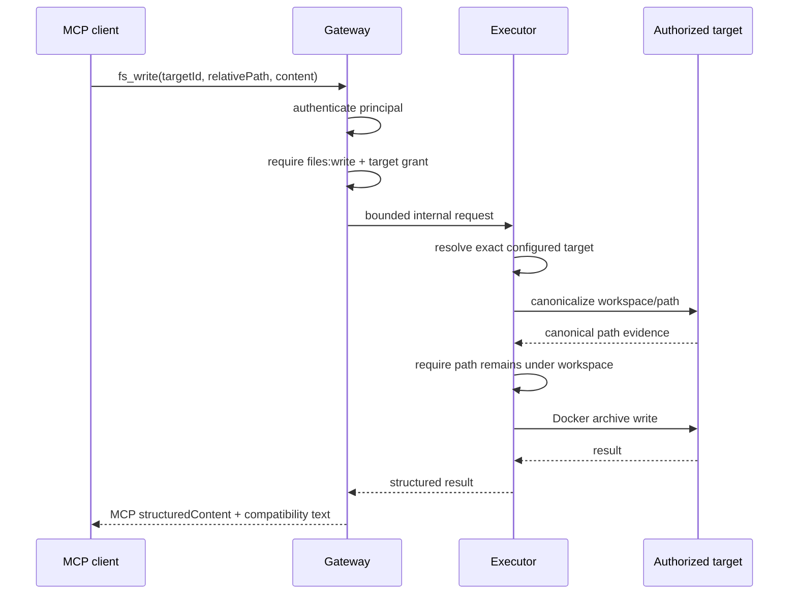
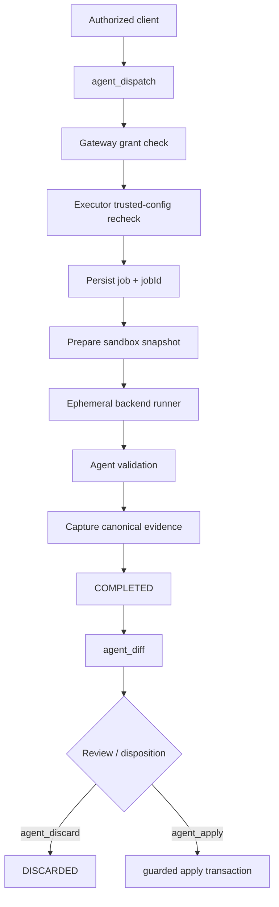
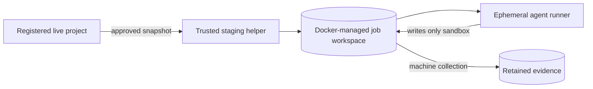
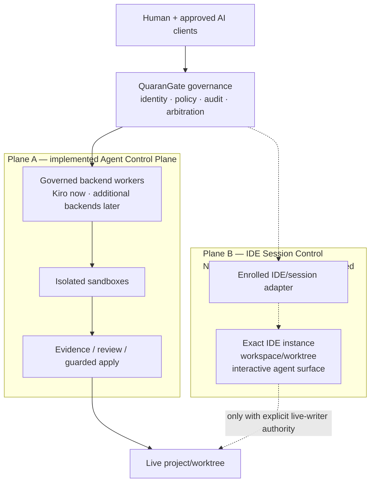

# Architecture

This document describes the **implemented QuaranGate architecture first**, then the approved **North-Star architecture** separately.

The distinction is deliberate. A future capability must never be drawn into a current-runtime diagram in a way that suggests it already exists.

---

## Contents

- [Architecture principles](#architecture-principles)
- [Current implemented runtime](#current-implemented-runtime)
- [Trust zones](#trust-zones)
- [Gateway](#gateway)
- [Executor](#executor)
- [Direct target operations](#direct-target-operations)
- [Target model](#target-model)
- [Filesystem confinement](#filesystem-confinement)
- [Terminal execution](#terminal-execution)
- [Agent Control Plane](#agent-control-plane)
- [Agent job and evidence storage](#agent-job-and-evidence-storage)
- [Sandbox and runner lifecycle](#sandbox-and-runner-lifecycle)
- [Diff, apply and discard](#diff-apply-and-discard)
- [Concurrency](#concurrency)
- [Network planes](#network-planes)
- [Current tool surface](#current-tool-surface)
- [North-Star architecture](#north-star-architecture)
- [What the North Star does not change](#what-the-north-star-does-not-change)

---

# Architecture principles

QuaranGate is designed around five architectural rules.

## 1. Public protocol and privileged execution are different trust domains

The process that accepts external MCP traffic does not hold Docker authority.

## 2. Callers address logical resources

Clients select target IDs, project IDs, backend IDs and profiles. They do not supply arbitrary host paths, Docker mounts, images or privilege settings.

## 3. Privileged operations are narrow and revalidated

The executor does not expose a generic Docker passthrough. It performs named operations and independently validates the trusted resource boundary.

## 4. Agent implementation and live promotion are separate

A write-capable coding agent works in a sandbox. Promotion to live source is a separate operation against stored evidence.

## 5. Current architecture and future architecture are documented separately

IDE Session Control, future backends and other North-Star capabilities are additive programs. They do not become “current” merely because the design exists.

---

# Current implemented runtime

The current QuaranGate runtime is built around a network-facing gateway and a private executor.



The diagram shows **implemented runtime authority**. It intentionally does not show the future IDE Session Control Plane.

---

# Trust zones

## External/client zone

Clients may be browsers, desktop applications, IDE integrations or other MCP-compatible callers.

The client is not trusted to choose its own authority. Authentication identifies a principal; configuration determines what that principal may do.

## Gateway zone

The gateway may be reachable through operator-approved ingress. It owns protocol/authentication/authorization behavior but no raw Docker authority.

## Executor zone

The executor is the privileged control component. It is private and holds Docker socket access.

## Agent worker zone

Agent runners are ephemeral and intentionally weaker than the executor. They receive sandbox state and the minimum backend credential/policy required by the job.

## Project/target zone

Targets and projects contain the actual development state QuaranGate is allowed to operate on.

The boundary between these zones is the core architecture, not a deployment detail.

---

# Gateway

The gateway is the public protocol boundary.

Responsibilities:

- host the MCP endpoint;
- authenticate static API keys and OAuth bearers;
- resolve the caller to a principal;
- enforce scopes and agent grants;
- validate strict tool schemas;
- rate limit;
- create structured/redacted audit records;
- call the executor through the private service path;
- return schema-conforming MCP results.

The gateway must not:

- mount `/var/run/docker.sock`;
- mount arbitrary host projects;
- expose an arbitrary Docker API;
- infer missing permissions from prompt text;
- silently expand a caller's target/project/backend authority.

## Request isolation

The MCP gateway is request-oriented rather than a global mutable “current client” session. Principal identity is bound to the request context so concurrent callers should not share authorization state accidentally.

## Health model

Two probes have different jobs:

```text
/healthz  -> process liveness
/readyz   -> operational readiness
```

Readiness can fail closed when required client configuration or executor reachability is unavailable even while the process remains alive for diagnosis.

---

# Executor

The executor is the trusted privileged component.

Responsibilities include:

- resolve configured/manual/opt-in targets;
- canonicalize workspaces;
- execute Docker target operations;
- enforce time/output/concurrency bounds;
- revalidate agent project/backend/profile policy;
- own the durable job engine;
- control sandbox/runner/helper lifecycle;
- collect evidence;
- perform guarded apply/discard lifecycle operations.

## Why Docker authority lives here

Direct target execution and sandbox lifecycle require Docker Engine operations. The architecture accepts that this is privileged and concentrates it into the smallest private control component rather than distributing the socket to the gateway or workers.

## What the executor API is not

The executor is not intended to expose:

```text
arbitrary Docker command
caller-selected host bind
caller-selected image
caller-selected privileged mode
run arbitrary command on WSL/host
```

Trusted configuration determines resource identity and execution policy.

---

# Direct target operations

The original QuaranGate surface performs IDE-style operations **inside explicitly authorized target containers**.

Example `fs_write` path:



A caller cannot replace `targetId` with a container ID or Docker image to bypass registration.

---

# Target model

Targets are Docker containers that QuaranGate may operate on through the direct tool surface.

## Manual targets

Trusted configuration can identify a target through stable deployment metadata such as Compose project/service and an absolute **in-container** workspace.

The client sees the logical target ID, not the host implementation details.

## Opt-in discovery

Containers may opt in using QuaranGate's target-discovery labels.

Discovery answers:

> Does this container identify itself as a candidate target?

It does **not** answer:

> May this principal use it?

Authorization remains a separate gate.

## Fail-closed resolution

The resolver refuses:

- unknown targets;
- offline targets where the operation requires a running container;
- ambiguous resolution when more than one candidate matches;
- unsupported target environments where minimum command/path assumptions are unavailable.

---

# Filesystem confinement

The direct filesystem model uses defense in depth.

## Gateway-side syntax validation

Path grammar rejects dangerous forms before the executor call.

## Executor-side validation

The privileged side repeats confinement checks rather than assuming the gateway's validation was sufficient.

## In-target canonicalization

QuaranGate resolves the configured workspace and requested path/ancestor inside the target and requires the canonical result to remain under the workspace.

This matters because:

```text
safe-looking path
workspace/docs/current
```

could contain a symlink that resolves to:

```text
/etc
```

Canonical path identity is stronger than string-prefix validation.

## Content transport

Binary-safe content operations use Docker archive/tar behavior where appropriate instead of composing arbitrary shell strings.

## Residual race

A target that can mutate its own filesystem could attempt a symlink race between check and use. The architecture narrows this window but does not claim to eliminate every filesystem TOCTOU possibility.

---

# Terminal execution

`terminal_exec` is the deliberate shell-capable target operation.

It runs a bounded command **inside the authorized target**, not on the QuaranGate host.

Current contract includes:

- workspace-confined working directory;
- default/max timeout;
- bounded output;
- per-principal/global concurrency limits;
- best-effort process cleanup on timeout;
- explicit `terminal:exec` authority.

The gateway has no host shell path, and the executor API has no ordinary “execute on host” verb.

---

# Agent Control Plane

The Agent Control Plane is an asynchronous governed execution system built on top of the gateway/executor split.



The operational Agent Control Plane includes:

```text
agents_list
agent_projects
agent_dispatch
agent_status
agent_result
agent_cancel
agent_diff
agent_apply
agent_discard
```

## Backend abstraction

The caller-facing contract is backend-neutral. A caller selects an authorized backend ID; backend-specific transport details remain behind the adapter.

The real implemented backend is Kiro ACP. A future Copilot backend is an A7 task, not part of the current implemented backend set.

## Profiles

Profiles represent enforcement policy rather than personality prompts.

Current design includes:

```text
audit
plan
implement
review
```

The profile determines workspace access, shell/Git policy, network policy and default resource policy.

---

# Agent job and evidence storage

The executor owns durable agent state using SQLite on the executor-owned jobs volume.

The job store preserves identities and lifecycle facts such as:

- job ID;
- principal;
- project/backend/profile;
- state/status;
- base commit/workspace state;
- evidence identity/hashes;
- disposition/apply state;
- retention metadata;
- quarantine/apply recovery metadata where applicable.

## Why executor-owned persistence?

An MCP client disconnect or gateway restart must not make an already-started job unknowable.

The job lifecycle is a trusted local execution fact, not transient browser state.

## Restart behavior

Active jobs are not silently resurrected after an unexpected restart. Recovery logic classifies incomplete activity conservatively and protects writer admission from double-running work.

---

# Sandbox and runner lifecycle

Write-capable agent work follows sandbox-first execution.



Important runner boundaries:

- no Docker socket;
- non-privileged;
- non-root where implemented/practical;
- `CapDrop=ALL`;
- no-new-privileges;
- read-only root filesystem;
- no arbitrary host bind;
- bounded CPU/memory/PIDs/runtime/output;
- network policy restricted by profile/backend policy.

The live project is not the normal write workspace for the coding agent.

---

# Diff, apply and discard

These are separate lifecycle operations because they carry different authority.

## `agent_diff`

Produces bounded machine-derived evidence from the stored job artifact.

It is not simply the agent's own narrative of what changed.

## `agent_apply`

Promotes stored evidence under a guarded transaction.

Important properties:

- separate `agents:apply` authority;
- exact job ownership;
- project grant;
- completed/unapplied prerequisite;
- no caller patch body;
- source/base-state verification;
- guarded path policy;
- one-time transition;
- apply journal/evidence;
- rollback proof;
- quarantine when rollback cannot be proven.

## `agent_discard`

Records rejection without changing live source.

Physical evidence retention is managed by the retention lifecycle rather than being blindly deleted at the moment of discard.

---

# Concurrency

The system deliberately distinguishes **parallel reasoning** from **parallel live mutation**.

Current governing principle:

```text
many readers
many isolated workers where policy permits
one controlled live writer per project/worktree
```

The implemented Agent Control Plane began with a stricter writer policy of one global active writer and one per project. Future concurrency work may expand isolated parallelism, but live promotion must remain arbitrated.

This matters even more once IDE Session Control is implemented: an apply operation and a mutation-capable live IDE session cannot be treated as unrelated writers against the same worktree.

---

# Network planes

QuaranGate conceptually separates three network concerns.

## Public control plane

```text
external MCP client
      ↓
approved public/remote ingress
      ↓
Gateway
```

QuaranGate binds loopback by default; external ingress is an operator action.

## Private operations/execution plane

```text
Gateway
   ↓
private internal service path
   ↓
Executor
```

The executor is not published as a public service.

## Agent data plane

```text
Runner
  ↓
backend-specific egress allowed by policy
```

Agent network policy is not the same thing as MCP ingress or host administration.

Host/Tailscale administration is outside normal agent authority.

---

# Current tool surface

The current operational MCP surface contains 23 tools.

## Direct tools — 14

```text
targets_list
target_inspect
fs_list
fs_stat
fs_read
fs_search
fs_write
fs_patch
fs_delete
terminal_exec
git_status
git_diff
git_log
process_list
```

## Agent Control Plane — 9

```text
agents_list
agent_projects
agent_dispatch
agent_status
agent_result
agent_cancel
agent_diff
agent_apply
agent_discard
```

All public tool contracts are schema-based. Successful operations return structured MCP results and the project's maintained compatibility representation.

---

# North-Star architecture

The approved North Star extends QuaranGate beyond isolated worker orchestration by adding a separately authorized IDE Session Control Plane.

This is **future architecture**, not the current runtime.



## Required IDE program targets

Primary required targets:

```text
Kiro
VS Code
Cursor
```

Secondary feasibility targets:

```text
Visual Studio
Antigravity
```

A VS Code Chat Participant spike has proven one public-API architecture feasible. That spike is explicitly not a production adapter and does not establish Kiro/Cursor support.

## Independent authority

Plane A and Plane B do not imply one another.

A principal allowed to dispatch a sandbox job must not automatically receive access to an open IDE session. Likewise, an IDE-session grant must not automatically grant arbitrary agent/project/target operations.

---

# What the North Star does not change

Even when QuaranGate reaches the full North Star, these principles remain:

- the gateway does not gain Docker socket authority;
- the executor remains the private privileged component;
- callers still use logical IDs rather than arbitrary host paths;
- sandbox work remains independently reviewable;
- live writer authority remains explicit and serialized;
- GUI automation cannot become the security boundary;
- agent prose does not become evidence;
- local inference does not automatically imply system-wide air-gap;
- current capability and roadmap capability remain documented separately.

The North Star expands controlled capability. It does not replace governance with autonomy.
