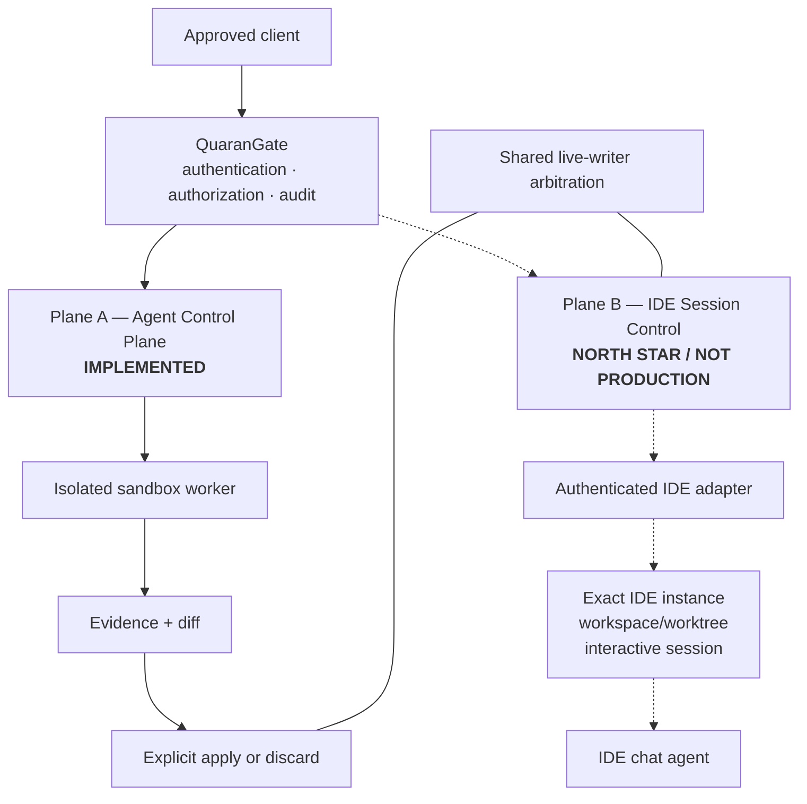

# IDE Session Control

**Status:** Approved North-Star design. Not a production capability.

IDE Session Control is the second major execution plane in QuaranGate. It is intended to let an authorized client communicate with an AI agent inside an explicitly enrolled, currently open IDE session without turning GUI automation, window focus or clipboard injection into a security boundary.

This document describes the **design contract**. It does not claim that Kiro, VS Code, Cursor, Visual Studio or Antigravity production adapters exist today.

> [!IMPORTANT]
> The implemented Agent Control Plane and the future IDE Session Control Plane are independent. Agent Dispatch permission does not grant IDE-session permission, and IDE-session permission does not grant Agent Dispatch, filesystem, terminal or target permission.

---

## Contents

- [Why this plane exists](#why-this-plane-exists)
- [Current status](#current-status)
- [The two execution planes](#the-two-execution-planes)
- [Design principles](#design-principles)
- [Authority model](#authority-model)
- [Enrollment and identity](#enrollment-and-identity)
- [Workspace and worktree binding](#workspace-and-worktree-binding)
- [Session identity and lifecycle](#session-identity-and-lifecycle)
- [Adapter contract](#adapter-contract)
- [Transport hierarchy](#transport-hierarchy)
- [Capability discovery](#capability-discovery)
- [Prompt delivery and response attribution](#prompt-delivery-and-response-attribution)
- [Cancellation and recovery](#cancellation-and-recovery)
- [Concurrency and one-writer control](#concurrency-and-one-writer-control)
- [Security and data-leakage model](#security-and-data-leakage-model)
- [Audit requirements](#audit-requirements)
- [IDE-specific roadmap](#ide-specific-roadmap)
- [Known evidence](#known-evidence)
- [Production acceptance requirements](#production-acceptance-requirements)
- [Non-goals](#non-goals)

---

# Why this plane exists

QuaranGate already has a governed worker model:

```text
client
  -> QuaranGate
  -> isolated agent runner
  -> sandbox
  -> evidence
  -> review
  -> explicit apply
```

That is the right model when the goal is controlled implementation with strong evidence and promotion boundaries.

But there is a separate developer use case: sometimes the user wants ChatGPT or another authorized client to collaborate with the AI agent that is already visible inside an IDE. The value is not merely “run another coding agent”. The value is preserving the interactive IDE experience while still putting identity, authorization, audit and writer control in front of it.

The unsafe shortcut would be:

```text
find a window
click the chat box
paste text
press Enter
scrape pixels
```

QuaranGate rejects that as the production authority model. Focus, mouse position and window titles are not durable identities, and GUI injection is too easy to misroute.

The intended design is a narrow machine-facing adapter that can prove which IDE instance, workspace and session it is connected to before any prompt is delivered.

---

# Current status

| Capability | Status | Meaning |
|---|---|---|
| Agent Control Plane | **Available** | Sandboxed dispatch, evidence, diff, guarded apply and discard are implemented. |
| VS Code Chat Participant architecture | **Feasibility proven** | S1 proved a QuaranGate-owned Chat Participant can share a deterministic core with a machine IPC path. |
| VS Code production IDE-session adapter | **Not implemented** | S1 was a spike, not production acceptance. |
| Kiro IDE Session Control | **Not implemented** | Required future target. Kiro S2 has not been authorized. |
| Cursor IDE Session Control | **Not implemented** | Required future target. |
| Visual Studio | **Feasibility target** | Secondary; does not block the North Star if no safe stable transport exists. |
| Antigravity | **Feasibility target** | Secondary; does not block the North Star if no safe stable transport exists. |
| Multi-client/session hardening | **Not implemented** | Required before production acceptance of this plane. |

The S1 evidence is important but narrow: it proves one VS Code architecture can work. It does **not** prove production security, complete host air-gap properties, Kiro integration, Cursor integration or generic active-session attachment.

---

# The two execution planes

## Current and North-Star relationship



Solid lines represent the implemented Agent Control Plane. Dashed lines represent the approved future IDE Session Control Plane.

## Why keep them separate?

A sandbox worker and a live IDE agent have different risk profiles.

A sandbox worker can be given an isolated copy of the project, no Docker socket and a tightly controlled environment. A live IDE agent may have access to editor state, extensions, terminals, vendor accounts and other workspace context.

Trying to pretend those are the same execution environment would weaken the security model.

---

# Design principles

## 1. Explicit enrollment, never ambient discovery authority

QuaranGate may discover that an IDE exists, but discovery does not authorize use.

An IDE instance must be explicitly enrolled before it can become an addressable resource.

## 2. Exact binding

Every operation must bind to:

```text
authenticated principal
  -> enrolled IDE instance
  -> authorized logical project
  -> exact workspace/worktree
  -> current session
  -> allowed action/capability
```

If any part is stale, ambiguous or contradictory, the request is refused.

## 3. Supported APIs before GUI automation

Preferred transports use supported extension, IPC or vendor session APIs.

Mouse, keyboard, clipboard, window focus and pixel scraping are fallback-only research techniques and cannot establish authority.

## 4. No silent fallback between architectures

If a provider-session interface is unavailable, QuaranGate must not quietly fall back to GUI automation or another adapter class.

The operator should know which transport is being used.

## 5. One live writer

Many readers and isolated workers may coexist. Only one controlled live writer may act against the same project/worktree at a time.

## 6. Prompt text is not a permission boundary

A prompt saying “do not edit files” is useful instruction, not enforcement. Unless the adapter can technically enforce read-only behavior, the interaction must be treated as potentially write-capable.

## 7. Local does not automatically mean private

A local IDE or local model can still use extensions, telemetry, update checks, authentication services or other network paths. IDE Session Control must treat host egress as a separate qualification question.

---

# Authority model

A permitted IDE-session action must satisfy the complete authorization tuple.

```text
principal
+ IDE enrollment
+ logical project grant
+ exact workspace/worktree identity
+ current session identity
+ capability/action grant
+ current connection generation
+ controller/writer lease when required
```

## Independent grant families

These authorities remain independent:

```text
target operations
agent dispatch
agent apply
IDE session control
```

For example, a principal might be allowed to:

```text
read a review target
```

while being denied:

```text
dispatch agent
control IDE session
apply sandbox result
```

That separation reduces accidental authority expansion.

## Why full-tuple authorization matters

Checking only “this user may use VS Code” would be too broad.

The real security question is:

> May this principal perform this action against this exact enrolled IDE instance, on this exact workspace/worktree, in this current session, right now?

---

# Enrollment and identity

## IDE instance identity

A production adapter needs a durable enrollment identity that is stronger than:

- window title;
- process ID alone;
- “most recently active” IDE;
- display name;
- foreground focus;
- folder label.

The enrollment should bind an adapter instance to a QuaranGate-generated identity and authenticated local channel.

Useful attestation fields may include:

```text
adapter ID/version
IDE product/version
extension/adapter version
remote kind
workspace URI
canonical workspace path or non-secret fingerprint
connection generation
capability snapshot
```

The exact schema belongs to the implementation gate for each IDE.

## Why connection generations matter

If an IDE restarts and reconnects, an old session handle must not automatically remain trusted.

A new connection generation gives QuaranGate a clean way to invalidate stale handles and pending operations.

---

# Workspace and worktree binding

The adapter must prove the exact workspace it represents.

For a Git project, the binding should distinguish the logical project from the exact worktree currently open.

```text
logical project: QuaranGate
worktree: /approved/canonical/worktree
IDE instance: enrolled adapter X
session: current session Y
```

## Why this matters

Two windows can have similar names while pointing at different branches or worktrees.

A prompt intended for a review worktree must never land in the live writer worktree merely because both windows display “QuaranGate”.

## Canonicalization

Where filesystem identity is used, canonical path resolution must account for:

- symlinks;
- relative paths;
- remote/WSL mapping;
- case behavior where relevant;
- multiple worktrees;
- workspace folders.

The caller should address logical resources. QuaranGate and the enrolled adapter perform identity resolution.

---

# Session identity and lifecycle

An interactive chat session is not permanent authority.

A production design must define:

```text
discovered
enrolled
connected
session available
controller acquired
operation active
disconnected
stale/replaced
```

## Required lifecycle behavior

- stale sessions deny;
- ambiguous session selection denies;
- reconnect creates a new connection generation;
- in-flight operations receive explicit terminal reconciliation;
- session ownership cannot cross project or principal boundaries silently;
- restarting an IDE does not silently reattach old controller authority.

---

# Adapter contract

The public QuaranGate API should remain backend-neutral even though each IDE has different native APIs.

Conceptual adapter responsibilities:

```text
identify()
capabilities()
listSessions()
attestWorkspace()
startTurn()
cancelTurn()
streamEvents()
close()
```

Exact names are not frozen by this design document.

## Normalized event model

Useful normalized events include:

```text
operation_started
assistant_chunk
tool_activity
status
completed
cancelled
failed
disconnected
```

Each event should carry:

```text
operation ID
session identity
sequence number
origin/provenance
bounded payload
```

## Why normalize?

QuaranGate should not force its public contract to mirror one vendor's private data model. A backend-neutral contract makes it possible to support VS Code, Kiro and Cursor without teaching every MCP client vendor-specific semantics.

---

# Transport hierarchy

Preferred order:

```text
1. Supported vendor/provider session interface
2. QuaranGate-owned companion extension / Chat Participant / local adapter
3. Supported CLI/ACP where it satisfies the exact use case
4. UI/accessibility automation only as a non-authoritative fallback research path
```

## Architecture A — provider session interface

Where a vendor exposes a supported interface to the relevant interactive session, QuaranGate may qualify it.

Requirements include:

- stable identity;
- explicit session addressing;
- cancellation;
- response attribution;
- workspace binding;
- documented compatibility surface.

No target has yet been production-qualified under Architecture A.

## Architecture B — QuaranGate-owned IDE participant/adapter

QuaranGate may own a first-class IDE integration built on public IDE APIs.

Advantages:

- QuaranGate controls its own protocol;
- machine IPC can share the same core as the visible IDE participant;
- exact workspace attestation can happen inside the IDE extension host;
- no requirement to attach to a vendor-private existing chat session;
- vendor independence between IDE UI and CLI/worker plane.

VS Code S1 proved this architecture feasible.

---

# Capability discovery

Adapters should report capabilities rather than forcing QuaranGate to guess.

Examples:

```text
streaming
cancellation
read-only enforcement
model selection
workspace attestation
tool-call visibility
session persistence
machine-started turns
human-visible turns
```

A capability not advertised and verified must be treated as unavailable.

## Why capability negotiation matters

IDE APIs change. A version update may add, remove or alter behavior. QuaranGate should fail closed on an unsupported capability instead of pretending a previous assumption still holds.

---

# Prompt delivery and response attribution

A delivered prompt must have an operation ID before the adapter starts processing it.

A production result should be attributable to:

```text
principal
IDE instance
workspace/worktree
session
operation ID
adapter version
connection generation
```

## Human-visible versus machine-only turns

An IDE may support:

- a visible Chat Participant turn;
- a machine IPC request handled by the same core;
- a provider session API;
- some combination of these.

QuaranGate must record which route was used. It must not claim that a machine-only IPC turn appeared in the user's visible vendor chat history unless that behavior is actually provided by the IDE.

---

# Cancellation and recovery

Cancellation must target one exact operation.

```text
cancel request
  -> authenticate
  -> verify IDE/session/workspace binding
  -> verify operation ownership
  -> signal exact operation
  -> reconcile terminal event
```

A global “cancel current task” flag is too ambiguous when multiple clients or operations exist.

## Disconnect handling

If the adapter disconnects during a turn, QuaranGate must not fabricate completion.

The safe outcomes are explicit states such as:

```text
cancelled
disconnected
failed
unknown/needs reconciliation
```

The exact production state model remains an implementation decision, but false success is prohibited.

---

# Concurrency and one-writer control

The North-Star system allows:

```text
many readers
many isolated sandbox workers
one controlled live writer per project/worktree
```

The live-writer boundary spans more than IDE Session Control.

Potential live writers include:

- `agent_apply`;
- a direct RW target lane;
- a mutation-capable IDE agent interaction;
- a future approved live-workspace operation.

These must participate in one arbitration policy.

## Why sandbox workers are different

An isolated worker can edit its private sandbox without owning the live-project writer lease.

It needs the live writer lease only when an approved transition crosses into the real worktree.

---

# Security and data-leakage model

## Threat: wrong IDE or workspace

**Risk:** a prompt is delivered to the wrong open project.

**Control:** explicit enrollment + exact canonical workspace/worktree binding + current connection generation.

## Threat: spoofed adapter

**Risk:** a malicious local process impersonates the IDE adapter.

**Control:** authenticated enrollment/channel, restrictive local IPC permissions, adapter identity/version checks and connection generation.

## Threat: prompt injection through live context

**Risk:** files, terminal output or IDE context influence the interactive model.

**Control:** least authority, explicit capability classification, no assumption that prompt instructions alone make the interaction read-only, and preference for Plane A when strong isolation is required.

## Threat: hidden network leakage

**Risk:** the IDE, extensions or model provider transmits content even when the QuaranGate adapter itself is local.

**Control:** separate IDE-host egress qualification. “Local model” or “local IPC” is not enough evidence to claim an air-gapped host.

## Threat: concurrent writers

**Risk:** IDE agent and apply transaction modify the same live worktree simultaneously.

**Control:** shared project/worktree live-writer lease.

## Threat: fabricated attribution

**Risk:** response is reported as belonging to the wrong request/session.

**Control:** operation IDs, ordered events, exact session/workspace binding and authenticated transport.

## Threat: stale cancellation/reconnect race

**Risk:** an old cancel command affects a new operation after reconnect.

**Control:** operation ID + connection generation + session identity checks.

## What this plane cannot inherit from Plane A

A live IDE session does not automatically have:

- immutable sandbox isolation;
- machine-derived Git diff as its only result;
- guarded apply as the only path to mutation;
- evidence-volume retention;
- no-network guarantees;
- no-editor-context guarantees.

Those differences must remain visible in both UI and documentation.

---

# Audit requirements

A production IDE-session operation should record at minimum:

```text
timestamp
request ID
principal
IDE type/version
adapter ID/version
enrolled instance ID
logical project
workspace/worktree identity
session reference
connection generation
operation ID
capability/action
controller/writer lease state
terminal outcome
duration
```

Prompt and response bodies should be bounded and redacted according to policy rather than blindly persisted.

Terminal, editor and filesystem context should not be dumped into audit merely because the IDE can see it.

---

# IDE-specific roadmap

| Gate | Target | Requirement | Current state |
|---|---|---|---|
| **I0** | Common contract | Authority, identity, transport and threat model | Design documented; not production-complete |
| **I1** | Kiro | Qualify supported machine-facing session/control architecture | Not started; Kiro S2 unauthorized |
| **I2** | VS Code | Production adapter using qualified Architecture A and/or B | Architecture B feasibility proven by S1; production adapter not started |
| **I3** | Cursor | Qualify supported adapter and workspace/session binding | Not started |
| **I4** | Visual Studio | Feasibility and adapter if safe/stable | Secondary |
| **I5** | Antigravity | Feasibility and adapter if safe/stable | Secondary |
| **I6** | Cross-adapter hardening | Multi-client concurrency, reconnect, writer arbitration, recovery, security acceptance | Required before production acceptance |

Kiro, VS Code and Cursor are required North-Star targets. Visual Studio and Antigravity are best-effort feasibility targets.

---

# Known evidence

## VS Code S1

The preserved S1 record proves that a QuaranGate-owned VS Code Chat Participant architecture can:

- run in the WSL workspace extension host;
- attest one canonical WSL workspace;
- expose a local authenticated Unix-domain IPC path;
- share one deterministic core between human and machine-origin operations;
- stream operation events;
- distinguish operation provenance;
- perform bounded cancellation without global cancellation state;
- avoid prompt persistence/logging in the spike implementation;
- coexist with a local model visible through VS Code's normal model picker.

S1 also explicitly records important limitations:

```text
PRODUCTION_READY = NO
AIRGAP_CERTIFIED = NO
ENTIRE_VSCODE_HOST_AIRGAP_PROVEN = NO
```

That evidence must not be upgraded into a broader claim.

## Kiro

Kiro's isolated Agent Control Plane backend is a separate capability. Its existence does not prove the ability to control an active Kiro IDE chat session.

Kiro S2 has not been authorized.

---

# Production acceptance requirements

IDE Session Control may be called production-ready only after the relevant adapter and I6 evidence prove all critical properties.

At minimum:

```text
[ ] enrolled adapter identity is authenticated
[ ] exact IDE instance is attributable
[ ] exact workspace/worktree binding is proven
[ ] session identity is current and non-ambiguous
[ ] stale/reconnect generation handling is proven
[ ] capability negotiation is fail-closed
[ ] prompt/result operation correlation is deterministic
[ ] streaming is bounded
[ ] cancellation targets one exact operation
[ ] disconnect cannot become false completion
[ ] multi-client controller rules are explicit
[ ] shared live-writer arbitration is enforced
[ ] prompts cannot silently cross project/worktree boundaries
[ ] adapter cannot become arbitrary host-command proxy
[ ] secrets are excluded/redacted appropriately
[ ] IDE-host network/data-leakage behavior is qualified separately
[ ] audit attribution is complete
[ ] rollback/recovery procedures are tested
[ ] current Agent Control Plane security does not regress
```

---

# Non-goals

IDE Session Control does **not** aim to:

- replace the Agent Control Plane;
- make a live IDE equivalent to a sandbox;
- inject prompts through clipboard as the normal transport;
- expose every open IDE automatically;
- expose arbitrary extension APIs;
- expose a generic local host shell;
- treat vendor-private chat memory as authorization;
- infer “read-only” from natural-language instructions;
- automatically fall back to cloud or another provider;
- claim an IDE host is air-gapped merely because the selected model is local;
- remove the owner approval boundary for live writes.

---

## Related documentation

- [`ARCHITECTURE.md`](ARCHITECTURE.md) — implemented system and North-Star architecture
- [`SECURITY.md`](SECURITY.md) — current threat model and enforced boundaries
- [`AGENT_CONTROL_PLANE.md`](AGENT_CONTROL_PLANE.md) — implemented sandbox worker and apply lifecycle
- [`IDE_CHAT_VSCODE_S1.md`](IDE_CHAT_VSCODE_S1.md) — preserved VS Code feasibility/acceptance evidence
- [`IDE_SESSION_KIRO_I1.md`](IDE_SESSION_KIRO_I1.md) — preserved Kiro feasibility record
- [`IDE_SESSION_VSCODE_I2.md`](IDE_SESSION_VSCODE_I2.md) — preserved VS Code/Kiro feasibility record
- [`../MCP_IDE_BRIDGE_MASTER_PRD.md`](../MCP_IDE_BRIDGE_MASTER_PRD.md) — canonical roadmap and decision history
