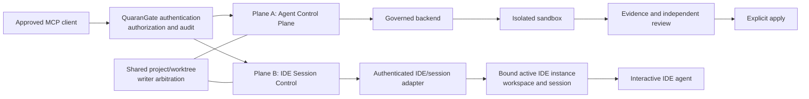

# IDE Session Control — I0 Architecture and Security Contract

**Status:** Owner-approved North-Star direction; I0 design candidate; documentation only; not implemented or accepted complete
**Required targets:** Kiro (I1), VS Code (I2), Cursor (I3)
**Secondary feasibility targets:** Visual Studio (I4), Antigravity (I5)
**Production prerequisite:** I6 concurrency, recovery, and hardening

## 1. Purpose and status boundary

IDE Session Control extends QuaranGate so an authorized MCP principal can communicate with the
active interactive AI agent in an explicitly selected, currently open IDE session. It complements
rather than replaces the implemented Agent Control Plane.

This document defines the I0 architecture, backend-neutral contract semantics, authority model,
threat model, adapter research gates, and additive I0-I6 roadmap. It does **not** assert that an IDE
adapter, IDE-session MCP surface, authorization store, extension, local service, or live-session
transport exists. Current implemented behavior remains the A0-A6 baseline described in the Master
PRD, `docs/ARCHITECTURE.md`, `docs/SECURITY.md`, and `docs/AGENT_CONTROL_PLANE.md`.

### 1.1 Owner-approved North Star

QuaranGate is the governed MCP control plane through which approved browser and desktop AI clients,
including ChatGPT, Claude, Codex, and future compatible MCP clients, can:

1. inspect and operate on explicitly authorized project workspaces;
2. dispatch isolated, governed implementation or review workers; and
3. when separately and explicitly authorized, provide a governed interactive IDE chat plane bound to
   an exact enrolled IDE instance and workspace, through supported IDE integration such as a
   QuaranGate-owned Chat Participant or a qualified provider session interface.

The two integration classes for item 3 are:

- **Architecture A — provider session interface:** attach to an active session exposed by a
  supported vendor-provided interface, only where such an interface exists and has been verified.
- **Architecture B — QuaranGate-owned Chat Participant:** a first-class QuaranGate-owned IDE Chat
  Participant using supported public IDE APIs; does not require attachment to a pre-existing
  vendor-private chat session; does not require the same vendor as the CLI/agent plane; does not
  require same-session concurrent attachment.

S1 (`docs/IDE_CHAT_VSCODE_S1.md`) has proven Architecture B feasible in VS Code. Architecture A has
not been proven for any target. The two classes are not mutually exclusive: a given adapter
implementation may use one or both where supported and verified. Neither silently replaces nor falls
back to the other.

The visible interactive IDE chat plane and the isolated Agent Control Plane are separate,
complementary execution modes. The IDE chat plane and the CLI/agent plane are independent.

### 1.2 Non-goals

I0 does not:

- implement or name final public MCP tools;
- begin I1, I2, I3, I4, I5, or I6 implementation;
- select or claim support for any unverified vendor API;
- turn mouse, keyboard, focus, or pixel scraping into an authority boundary;
- make an IDE session an isolated sandbox or give it the Agent Control Plane's evidence/apply
  guarantees;
- weaken sandbox-first dispatch, independent review, or explicit apply;
- grant ambient access to all IDEs, workspaces, sessions, terminals, files, or secrets on the host;
- make target, filesystem, terminal, Agent Dispatch, and IDE Session permissions imply one another;
- redesign or implement the owner-approved Ollama backend milestone, which belongs to a separate
  Kiro lane; or
- claim public exposure, workplace deployment, compliance, or production acceptance.

## 2. Evidence basis and architecture status

| Subject | Current repository evidence | I0 interpretation |
|---|---|---|
| Public/private privilege split | Master PRD §§2.4, 4; `docs/ARCHITECTURE.md`; `docs/SECURITY.md` | Must survive; an IDE adapter must not give the public gateway ambient host authority. |
| Isolated worker lifecycle | Master PRD §§6-20; `docs/AGENT_CONTROL_PLANE.md` | Implemented Plane A remains the default for governed implementation and evidence/apply. |
| Authorization separation | Master PRD §§11, 24; `docs/SECURITY.md` | Extended with a separately granted IDE-instance/workspace/session/action tuple. |
| Writer control | Master PRD §17; `docs/AGENT_CONTROL_PLANE.md` | The live IDE must participate in the same per-project/worktree writer arbitration. |
| Existing IDE wording | Master PRD §§2.3, 5.1, 42.3 | Reconciled: fragile GUI automation remains rejected, but a narrow authenticated extension or local adapter may be a production transport. |
| Vendor capabilities | Master PRD §§13, 14, 45 | Existing isolated-runner evidence is not proof of active interactive IDE-session access. Every adapter requires fresh vendor-documentation and live feasibility proof. |

Repository documentation establishes the implemented Agent Control Plane, but contains no evidence
that QuaranGate can currently enumerate or control an active Kiro, VS Code, Cursor, Visual Studio,
or Antigravity agent session. All IDE-session controls below are requirements, not current controls.

## 3. Two-plane architecture



### 3.1 Plane A — Isolated Agent Control Plane

```text
client -> QuaranGate -> governed backend -> isolated sandbox
       -> evidence -> independent review -> explicit apply
```

Plane A is the production path for bounded implementation with sandbox isolation, retained evidence,
and guarded application. I0 does not replace, bypass, or weaken it.

### 3.2 Plane B — IDE Session Control Plane

```text
client -> QuaranGate authorization -> IDE/session adapter
       -> active IDE/workspace/session -> interactive IDE agent
```

Plane B operates in a user's live environment. It must be described honestly: an interactive agent
may see editor, terminal, extension, account, and workspace context unavailable to a sandbox. Unless
an adapter proves a restriction technically, QuaranGate must assume a delivered prompt can cause
source mutation or other actions available to that interactive agent.

### 3.3 Shared invariants

- Authentication, authorization, request correlation, audit, bounds, and deny-by-default behavior
  remain QuaranGate responsibilities.
- The adapter exposes a narrow protocol; it is not a generic host shell, extension API proxy,
  window-automation proxy, or arbitrary filesystem bridge.
- Plane selection is explicit in authorization and audit. A caller cannot silently fall back from
  one plane to the other.
- Agent Dispatch authority does not imply IDE Session authority, and IDE Session authority does not
  imply Agent Dispatch authority.
- A project/worktree live-writer arbiter spans Plane A apply, Plane B mutation-capable interaction,
  and any direct live-workspace write path. Isolated sandbox work does not consume this live-writer
  lease until an apply crosses into the live project.

## 4. Trust zones and protected assets

| Zone or component | Holds or observes | Required boundary |
|---|---|---|
| MCP client and principal | User intent, client credential, returned session data | May address only logical resources and actions granted to that principal. |
| QuaranGate gateway/policy layer | Principal, grants, request policy, audit correlation | Must authorize the complete binding before contacting an adapter; no ambient host discovery. |
| IDE-session broker or local adapter | Enrollment credential, connection registry, normalized events | Narrow allowlisted protocol; local-only or equivalently protected transport; no arbitrary host verbs. |
| Companion extension, if selected | IDE APIs, workspace identity, interactive session handle | Least privilege; explicit enrollment; authenticated broker channel; exact workspace/session binding. |
| Vendor IDE/agent | Editor, agent conversation, vendor account, tools, workspace and possibly terminal | Treated as a separate trusted computing base that may be compromised or over-privileged. |
| Project/worktree | Source, configuration, local uncommitted state | One controlled live writer; no wrong-workspace routing; no implicit mutation grant. |
| Audit/evidence store | Decisions, correlations, bounded response metadata and hashes | Integrity, redaction, retention, principal/session attribution, and operator access controls. |

Protected assets include source integrity; uncommitted work; terminal and filesystem context; prompts
and responses; vendor and QuaranGate credentials; IDE/session identities; controller and writer
leases; audit integrity; and the sandbox guarantees of Plane A.

## 5. Authority model

Every allowed operation must resolve and validate the complete tuple:

```text
authenticated principal
  -> enrolled IDE instance
  -> authorized logical project and exact workspace/worktree
  -> current interactive session on that workspace
  -> allowed capability/action
  -> current connection generation and, when needed, controller/writer lease
```

### 5.1 Grant properties

- Grants are explicit allowlists. Missing, stale, ambiguous, or conflicting bindings deny.
- IDE discovery is identification, never authorization.
- A friendly IDE name, window title, recent-file path, process owner, or "active" flag is not an
  identity proof.
- A wildcard, if ever supported, may mean all entries in an operator-enrolled registry; it must
  never mean every IDE process or session on the host.
- Observation, prompt/control, bounded context read, cancellation, and writer-capable interaction
  are separable policy dimensions. These are contract concepts, not frozen public enum names.
- Reading editor, filesystem, or terminal context requires its own bounded capability. Permission
  to prompt an agent does not automatically expose those contexts in MCP responses.
- A prompt channel that cannot technically prevent mutation is writer-capable and must acquire the
  project/worktree live-writer lease before delivery.
- Human interaction in the IDE is not silently overridden. The implementation phase must define a
  visible ownership/takeover policy and fail closed when exclusive control cannot be established.

### 5.2 Enforcement placement

QuaranGate must authorize the full tuple before dispatch. The local broker/adapter must independently
verify the principal-derived grant or a narrowly scoped, short-lived capability issued by
QuaranGate, confirm the current IDE/workspace/session binding, and reject mismatches. The extension
must not trust caller-supplied paths, display names, vendor session IDs, or claimed capabilities.

## 6. Identity and lifecycle contract

### 6.1 IDE instance identity

An instance record needs an opaque QuaranGate enrollment identity, vendor/type, verified version,
adapter identity and version, connection generation, authentication state, supported capabilities,
and freshness. Process IDs, ports, window handles, and display names are mutable observations, not
stable authorization identities.

### 6.2 Workspace/project identity

The public contract uses a logical project identifier. Trusted local configuration binds it to the
expected workspace/worktree identity. An adapter reports its current workspace through a canonical,
vendor-appropriate identity proof; QuaranGate compares it to the trusted binding without returning
host paths to the caller. Multi-root workspaces require an explicit, unambiguous mapping and must
deny operations whose target root cannot be proven.

The binding must detect changes material to write safety, such as a different worktree, repository,
root, or revision where the proposed action depends on a revision. Editor buffer identity and
version must be distinguished from the on-disk path and content revision so an unsaved buffer cannot
be silently overwritten from stale disk state. Merely sharing a repository name or remote URL is
insufficient.

### 6.3 Interactive session identity

A session record needs an opaque QuaranGate session reference bound to one enrolled instance, one
workspace identity, one adapter connection generation, one vendor session handle, and observed
creation/last-seen state. Vendor handles stay adapter-side where possible. A reconnect creates a new
connection generation; old references become stale until explicitly and securely rebound.

"Active" means a machine-verifiable vendor/extension state under a documented rule. It must not be
inferred only from foreground-window focus or the most recently observed chat panel.

### 6.4 Required lifecycle behavior

- Connection: mutually authenticate, negotiate protocol/version, attest instance and workspace,
  discover capabilities, then mark ready.
- Disconnection: revoke readiness and controller/writer leases, reject new operations, and retain a
  bounded audit trail.
- Recovery: reauthenticate and re-enumerate; never resume control solely from a display label or old
  socket. Reconcile in-flight operation IDs before accepting new prompts.
- Staleness: freshness deadlines and connection generations invalidate cached session state.
- Removal: operator de-enrollment revokes instance trust and all derived session authority.

## 7. Backend-neutral common adapter contract

This section defines semantics, not final MCP tool names or wire schemas. Normal callers must not
contain Kiro-, VS Code-, Cursor-, Visual Studio-, or Antigravity-specific orchestration logic.

### 7.1 Discovery concepts

The adapter abstraction must support:

- enumerate only enrolled and principal-authorized IDE instances and sessions;
- report IDE type/version, adapter version, connection freshness, and authentication assurance;
- identify the logical project and exact workspace/worktree binding without leaking host paths;
- identify the active interactive session under a vendor-proven rule; and
- report negotiated capabilities, limits, and reasons for unavailable capabilities.

Discovery results are snapshots with a connection generation and expiry. They confer no authority.

### 7.2 Interaction concepts

The common abstraction must support, where a capability is both available and authorized:

- submit one bounded prompt/instruction to a bound session;
- receive ordered, bounded progress events and one authenticated final outcome;
- cancel a specific active operation;
- inspect explicitly selected, bounded IDE/session context;
- observe connection, session, and operation state; and
- recover or terminate an interrupted operation without duplicating prompt delivery.

An interaction request must bind at least: request/correlation ID, authenticated principal, IDE
instance, logical project/workspace identity, session reference, connection generation, requested
capability, bounds, controller/writer lease when applicable, and an idempotency value. It must not
accept a host path, arbitrary adapter command, vendor-specific executable argument, extension method,
or raw transport destination from the caller. A mutation targeting an editor document must also bind
the adapter-owned document identity and expected buffer version or content digest and return an
explicit conflict when the precondition no longer holds.

### 7.3 Normalized outcomes and events

Adapters normalize vendor events into a small semantic model: accepted, queued or busy, progress,
agent response fragment, capability request/denial, cancellation state, completed, failed, stale, or
disconnected. Exact names remain an implementation decision.

Every event binds to the operation, session, instance, workspace, connection generation, monotonic
adapter sequence, and authenticated channel. QuaranGate rejects duplicates, impossible transitions,
wrong-generation events, and events after a terminal outcome. Large/raw transcripts, terminal output,
file contents, tool arguments, and secrets are neither default results nor default audit payloads.

### 7.4 Cancellation semantics

Cancellation targets an operation ID, not "whatever is active." The adapter must acknowledge
whether cancellation was accepted, already terminal, unsupported, or indeterminate. A cancel request
does not prove the interactive agent stopped. The terminal outcome must record the race between
completion, vendor cancellation, disconnect, and timeout; late events are quarantined from the
authoritative result. If stop cannot be proven, release of writer authority must follow a conservative
reconciliation policy, not an optimistic timeout.

### 7.5 Response authenticity

A response is attributable only when received over the authenticated channel from the enrolled
adapter, carrying the expected operation/session/workspace/generation binding and valid event order.
Agent prose claiming an identity or completion is not proof. The design must preserve hashes or
equivalent integrity metadata for bounded retained results while avoiding claims that Plane B has the
same reproducible evidence as Plane A.

## 8. Capability discovery

Capabilities are negotiated per adapter version, IDE version, session, and current workspace state;
they are not inferred from vendor name. The description must distinguish at minimum:

- session enumeration and active-session determination;
- prompt delivery;
- incremental and final response retrieval;
- cancellation and proof of termination;
- bounded editor/selection/diagnostic context;
- bounded terminal context;
- bounded filesystem context;
- read-only enforcement, if technically real;
- source-mutation possibility;
- reconnect/resume support; and
- human-visible controller/consent signals.

Unknown, degraded, or unverified capability means unavailable. Version changes require renegotiation
and may require re-approval or re-enrollment.

## 9. Concurrency and ownership

QuaranGate preserves the operating rule:

```text
many readers
many isolated workers
one controlled live writer per project/worktree
```

Multiple clients may observe the same authorized session if policy permits. Prompt delivery is
serialized per interactive session. At most one principal holds the session's active controller
lease, and at most one live-source mutation path—Plane A apply, Plane B mutation-capable interaction,
or direct live-workspace mutation—may hold the project/worktree live-writer lease. Multiple isolated
workers remain architecturally compatible because they operate on separate sandboxes; the current
implemented Agent Control Plane may retain stricter serialization until a later gate safely relaxes
it. A controller lease does not necessarily grant writer authority; a writer lease never broadens
project, session, or action grants.

Leases must have an owner principal, request, acquisition time, bounded expiry, connection
generation, explicit renewal, and auditable release reason. Disconnect, cancellation, human takeover,
IDE closure, workspace change, or adapter degradation prevents new work and triggers reconciliation.
No last-write-wins prompt queue, silent controller preemption, or uncontrolled multi-writer mode is
acceptable.

Read-only behavior may be treated as non-writing only if the adapter can enforce it. A policy prompt
such as "do not edit" is not enforcement; otherwise the interaction consumes the live-writer lease.

## 10. Transport hierarchy

Two integration classes exist; a given adapter may use one or both where supported and verified:

**Architecture A — provider session interface:** attach to an active session exposed by a supported
vendor-provided interface. Valid only where a supported interface exists, has been officially
documented, and has been proven through a live feasibility gate. Architecture A has not been proven
for any target at this document baseline.

**Architecture B — QuaranGate-owned Chat Participant:** a first-class QuaranGate-owned Chat
Participant using supported public IDE APIs (e.g. VS Code chat contribution points). Does not
require attachment to a pre-existing vendor-private chat session. Does not require the same vendor
as the CLI/agent plane. Does not require same-session concurrent attachment. S1 has proven
Architecture B feasible in VS Code (see `docs/IDE_CHAT_VSCODE_S1.md`).

Within each class, the production transport selection order is:

1. a supported machine-facing IDE/agent API or protocol;
2. a QuaranGate companion extension and/or local adapter exposing a narrow authenticated
   machine-facing interface (Architecture B companion extensions are a legitimate production
   transport under this entry); and
3. accessibility or UI automation only as an explicitly approved fallback.

A companion extension is legitimate when its API is narrow, versioned, authenticated,
deny-by-default, workspace/session-bound, bounded, auditable, and incapable of arbitrary extension
or host command dispatch. Local transport does not remove the need for authentication. Unix sockets,
named pipes, or loopback listeners require peer/authentication and ownership controls appropriate to
the platform.

Fallback UI automation cannot use focus, clicks, keystrokes, clipboard contents, accessibility tree
labels, or screen pixels as authorization proof. It must never become the default production path,
and no adapter may silently downgrade to it when a stronger transport fails.

## 11. IDE-specific adapter study

No API named in this section is presumed to exist. Fresh official vendor documentation, current
version compatibility research, a minimal live proof, and security review are mandatory before each
implementation phase.

### 11.1 I1 — Kiro adapter (required)

Two integration classes must be evaluated for I1:

- **Architecture A:** whether a supported API/protocol can access the **currently interactive Kiro
  IDE agent session** — not merely launch a separate Kiro CLI/ACP session. Existing A4 and A5 ACP
  evidence applies to isolated runners and is not proof of this capability. Architecture A for Kiro
  has not been proven.
- **Architecture B:** whether a QuaranGate-owned companion Chat Participant or equivalent can be
  loaded in the Kiro extension host using supported public Kiro APIs, in the same pattern proven
  feasible for VS Code in S1 (`docs/IDE_CHAT_VSCODE_S1.md`). S1 does NOT prove Kiro supports the
  VS Code Chat Participant contribution point or the same API surface; a fresh equivalent live
  qualification on the exact installed Kiro build is required.

Do NOT claim direct Kiro built-in chat attachment exists. Do NOT infer VS Code S1 automatically
proves Kiro integration. Kiro S2 has not started and no Kiro upgrade is authorized.

Research and acceptance evidence must cover for whichever architecture class is attempted:
supported interface and version policy; extension/participant API; active chat/session discovery
(Architecture A) or participant contribution and registration (Architecture B); prompt delivery;
ordered response/event retrieval; cancellation and terminal proof; workspace/worktree identity;
session stability across reconnect; adapter authentication/enrollment; least privilege;
user-visible ownership; and the boundary between Kiro account/tools and QuaranGate authority. If no
safe supported interface exists for either class, stop I1 and return a feasibility block rather than
substituting GUI injection.

### 11.2 I2 — VS Code adapter (required)

Two integration classes must be evaluated for I2:

- **Architecture A:** establish which interactive AI agent(s) are in scope and prove a supported VS
  Code or agent-provider interface for attaching to an active session. The presence of VS Code
  extension APIs or the separate planned A7 GitHub Copilot worker does not prove access to an active
  interactive agent chat. Architecture A for VS Code has not been proven.
- **Architecture B:** a QuaranGate-owned Chat Participant using supported public VS Code APIs. S1
  (`docs/IDE_CHAT_VSCODE_S1.md`) has proven Architecture B feasible: participant registration, Remote
  WSL placement, public Chat Participant API, machine Unix-domain IPC, live human streaming, and
  live human cancellation all passed. A supported local Ollama provider satisfied the VS Code
  model-selection precondition; Ollama is not a permanent production architecture requirement.

S1 is a spike; PRODUCTION_READY=NO and AIRGAP_CERTIFIED=NO. Same-session concurrent attachment
remains a non-goal. Architecture A has not been proven and must not be claimed.

Evidence for full I2 must additionally cover (beyond what S1 proved): production authentication and
enrollment; trusted adapter distribution and update policy; connection generations; multi-root
workspaces; remote/WSL/container windows; extension-host restarts; whether context or mutation
restrictions are technically enforceable; persistent audit; controller/writer lease integration; and
IDE-host egress qualification.

### 11.3 I3 — Cursor active-session adapter (required)

I3 must prove a supported Cursor integration surface for its active interactive agent. Compatibility
with VS Code extensions must not be assumed to include chat/session APIs, security behavior, or
version stability.

Evidence must cover the same contract requirements as I1 and I2, plus Cursor-specific extension
compatibility limits, workspace identity across local/remote modes, agent-session ownership, account
boundary, event provenance, and cancellation behavior.

### 11.4 I4 — Visual Studio feasibility (secondary)

I4 is best effort and must not block North-Star completion. Research must determine whether current,
supported Visual Studio extensibility or an agent-provider interface can meet the common contract
without broad automation or credential inheritance. Windows local-transport ACLs, multiple solution
instances, solution/workspace identity, extension signing/update trust, active-agent access, prompt,
events, cancellation, and authentication all require proof. If any critical property is absent, record
the gap and do not build an unsafe adapter.

### 11.5 I5 — Antigravity feasibility (secondary)

I5 is best effort and must not block North-Star completion. The product/vendor identity, supported
extensibility model, active-agent integration surface, platform support, session/workspace identity,
prompt/event/cancel semantics, authentication, and security boundary are all presently unknown and
require fresh official-source research. Ambiguous product naming or unofficial automation is not a
basis for implementation.

## 12. Threat model

The following are design hypotheses and acceptance risks, not validated vulnerabilities in current
runtime code.

### 12.1 Security objectives

- Route only to the exact enrolled instance, authorized project/worktree, current session, and
  allowed action.
- Keep discovery separate from authorization and keep Plane A and Plane B grants independent.
- Preserve one controlled live writer and make controller ownership visible and attributable.
- Treat prompt content, agent output, repository text, IDE context, and adapter events as untrusted.
- Bound and redact all context, responses, events, queues, retries, and retained evidence.
- Fail closed on ambiguity, staleness, version drift, disconnect, authentication failure, unsupported
  capability, or inability to prove cancellation/ownership.
- Preserve response provenance without trusting self-assertions in agent prose.
- Never expose secrets or ambient terminal/filesystem context by default.

### 12.2 Prioritized attacker stories and mitigations

| Priority | Scenario and capability gain | Prerequisites | Impact | Required mitigation / acceptance evidence |
|---|---|---|---|---|
| High | Wrong-workspace or wrong-worktree routing sends a prompt to a more privileged project. | Ambiguous/stale identity or caller-controlled selection data. | Unauthorized read or mutation. | Trusted logical mapping, canonical adapter proof, generation/revision binding, ambiguity denial, negative multi-root/worktree tests. |
| High | Session spoofing or stale-session reuse binds a caller to another user's/new session. | Guessable/reused handle or reconnect without reauthentication. | Conversation/context disclosure and unauthorized control. | Opaque broker references, authenticated enrollment, connection generations, freshness, re-enumeration, ownership checks. |
| High | Compromised/malicious adapter fabricates capability, context, responses, or workspace identity. | Adapter/extension compromise. | Source mutation, data disclosure, false audit evidence. | Narrow least-privilege adapter, mutual authentication, signed/trusted distribution decision, independent binding checks, version pin/allowlist policy, explicit residual-risk treatment. |
| High | Concurrent clients or a human and MCP client race prompts/writes. | Missing or split controller/writer arbitration. | Conflicting mutations, misattribution, loss of work. | Session serialization, visible controller ownership, shared project/worktree writer lease, no silent preemption, adversarial race tests. |
| High | Prompt injection in source, chat, diagnostics, or tool output induces actions beyond intent. | Interactive agent can act on untrusted context. | Secret access, terminal action, source mutation. | Treat prompt as non-boundary; technical capability limits; separate context/mutation grants; bounded results; prefer Plane A for governed implementation. |
| High | IDE Session permission is confused with Agent Dispatch, target, filesystem, or terminal authority. | Coarse or inherited grants. | Cross-plane privilege escalation. | Independent closed grants and negative authorization matrix tests at gateway and adapter. |
| High | Cancellation race releases writer control while the agent continues. | Cancel acknowledgement mistaken for termination or disconnect. | Uncontrolled post-cancel mutation. | Operation-specific cancel, terminal reconciliation, late-event quarantine, conservative lease release, indeterminate state requiring operator recovery. |
| High | Terminal/filesystem/editor context is returned ambiently. | Over-broad extension APIs or default context capture. | Credential, source, or private-data exposure. | Separate explicit bounded context grants, allowlisted fields, path/root confinement, redaction, no raw transcript/terminal dump by default. |
| Medium | Multiple active IDEs or duplicate labels cause routing confusion. | Selection by name/window/focus. | Wrong session control. | Enrolled opaque instance IDs, current proofs, explicit caller selection among authorized records, ambiguous-match denial. |
| Medium | Disconnect/reconnect duplicates prompt delivery or accepts forged late events. | Retry without idempotency/generation state. | Duplicate actions or false result. | Idempotency, monotonic sequences, connection generations, state reconciliation before retry. |
| Medium | Response content is attributed to the wrong agent/session/client. | Missing end-to-end correlation. | False decisions and audit history. | Authenticated channel, complete event binding, one terminal outcome, result integrity metadata. |
| Medium | Secret-bearing prompts/responses leak through logs or long-term evidence. | Body logging or over-retention. | Credential/privacy compromise. | Hash/redact by default, bounded encrypted/protected evidence if approved, explicit retention and access policy, secret-pattern tests. |
| Medium | Source mutates through a supposedly read-only prompt. | Restriction exists only in instructions. | Bypass of writer policy. | Treat as writer-capable unless a technical read-only control is proven and tested. |
| Medium | Adapter exposes a generic extension/host command primitive. | Over-broad companion API. | Host authority beyond contract. | Closed request schema, no raw method names/argv/paths/destinations, allowlisted operations, fuzz and negative tests. |
| Low/conditional | Accessibility fallback targets the wrong window or leaks clipboard data. | Explicit fallback is enabled. | Misrouting or disclosure. | Never primary/default; separate owner approval and threat review; visible confirmation; no authority inferred from UI; fail closed on focus ambiguity. |

### 12.3 Severity calibration

- **Critical:** a remotely reachable path from an ordinarily authorized principal to arbitrary host
  execution or cross-project control without a required grant, especially if broadly repeatable.
- **High:** reliable wrong-workspace mutation, cross-principal session takeover, secret/terminal
  disclosure, or multi-writer corruption across an intended trust boundary.
- **Medium:** same-principal duplication, bounded context disclosure, denial of service, or audit
  misattribution requiring meaningful prerequisites and without host/cross-project escalation.
- **Low:** fail-closed availability or metadata issues with no new authority. Ordinary actions already
  within the exact principal/session/action grant are not security impact by themselves.

Severity depends on reachability, adapter privileges, exposed transport, effective grants, and
technical controls. Missing evidence is an open question, not evidence of either safety or a flaw.

## 13. Audit requirements

Every discovery, authorization decision, connection transition, lease action, context read, prompt,
event stream, cancellation, recovery, denial, and terminal outcome must be attributable. The audit
record should include:

- timestamp, request/correlation/operation IDs, and idempotency value;
- principal and client authentication method/assurance (not the credential);
- plane and conceptual action;
- enrolled IDE instance/type/version and adapter identity/version;
- logical project, non-secret workspace/worktree identity, session reference, and connection
  generation;
- capability snapshot/version and controller/writer lease owner where relevant;
- authorization decision, enforcing layer, reason code, state transition, duration, and bounded
  response/event metadata;
- cancellation requester, acknowledgement, terminal reconciliation, disconnect/recovery reason; and
- prompt/result hashes and sizes when required, without blindly logging bodies, file contents,
  terminal output, tokens, host paths, or secrets.

Adapter and QuaranGate events require shared correlation and clock/ordering reconciliation. Audit
integrity must not depend solely on agent prose or a compromised adapter's uncorroborated claim.

## 14. Additive I0-I6 roadmap

The I-series is additive and does not renumber, reopen, or rewrite A0-A9.

| Phase | Scope | Requirement | Status at this document |
|---|---|---|---|
| I0 | Common IDE-session contract plus threat/security model | Required | Design baseline documented; **not implemented or accepted complete** |
| I1 | Kiro adapter (Architecture A: active-session; Architecture B: Chat Participant) | Required for updated North Star | Not started; Kiro S2 unauthorized; VS Code S1 does NOT prove Kiro integration |
| I2 | VS Code adapter (Architecture A: active-session; Architecture B: Chat Participant) | Required for updated North Star | Architecture B feasibility proven by S1 (`docs/IDE_CHAT_VSCODE_S1.md`); PRODUCTION_READY=NO; full production adapter not started |
| I3 | Cursor active-session adapter | Required for updated North Star | Not started |
| I4 | Visual Studio feasibility and adapter only if safe/practical | Secondary, best effort | Not started; feasibility unknown |
| I5 | Antigravity feasibility and adapter only if safe/practical | Secondary, best effort | Not started; feasibility unknown |
| I6 | Multi-client/session concurrency, recovery, and hardening | Required before production acceptance; may be separate or folded into A9 | Not started |

I0-I3 are required for the updated North Star. I4-I5 do not block it if no safe, stable integration
surface exists. I6 must complete before production acceptance, whether independently or explicitly
folded into A9 with equivalent evidence.

A0-A6 remain complete. A7 (GitHub Copilot backend), A8 (Agent Control Plane session continuity), and
A9 (production hardening plus E2E) remain not started. The owner-approved immediate milestone is a
governed Ollama local backend in a separate Kiro lane; this document neither implements nor redesigns
that work.

## 15. Open research questions

The following require fresh official vendor documentation and current live evidence before adapter
implementation:

1. Does each IDE expose a supported machine-facing surface for its **existing active interactive
   agent session**, rather than only a new headless/CLI session?
2. Can it enumerate sessions and determine "active" without focus/window heuristics?
3. Can it deliver prompts and retrieve ordered streamed/final events with stable correlation?
4. What cancellation semantics exist, and how can terminal cessation be proven?
5. What canonical workspace, multi-root, remote-window, solution, repository, and worktree identities
   are available?
6. What session identifiers persist across extension-host/IDE restart, and under which account?
7. Can a companion extension expose only the required operations, or do vendor APIs force broad
   editor/account/terminal privileges?
8. Can read-only interaction be technically enforced, or must all prompts be writer-capable?
9. What authentication, extension signing, distribution, update, revocation, and local peer-identity
   controls are supported on each target platform?
10. Which response/tool/context fields may contain secrets, terminal data, filesystem data, or
    vendor-account metadata, and which can be suppressed or bounded?
11. How do vendor version changes advertise or break capabilities, and what compatibility matrix and
    fail-closed pinning policy is supportable?
12. For Visual Studio and Antigravity, does any safe/stable supported surface exist at all?

## 16. Open owner decisions

Implementation requires explicit owner decisions on:

- when and how the human in the IDE grants, sees, transfers, or revokes controller ownership;
- whether prompt-only interaction is always classified as live-writer authority unless technical
  read-only enforcement is proven;
- arbitration priority among the human, multiple MCP principals, direct live-workspace tools, and
  Plane A apply;
- whether any Plane B source mutation is allowed initially, and what review/readback is mandatory;
- adapter enrollment, trust-on-first-use prohibition, signing/pinning, rotation, and revocation;
- prompt/response/context retention, encryption, redaction, and operator access;
- acceptable behavior for indeterminate cancellation or adapter compromise; and
- whether I6 is a separate gate or an explicit evidence-bearing subset of A9.

## 17. Explicit implementation stop conditions

Stop and return a design/feasibility block rather than improvising if:

- no supported machine-facing active-session interface or safely narrow companion extension is
  available for a required adapter;
- implementation would require GUI automation as the primary authority/transport model;
- exact IDE instance, workspace/worktree, active session, principal, or action binding cannot be
  proven;
- the adapter requires ambient host, terminal, filesystem, account, or all-session access that
  cannot be technically narrowed and explicitly approved;
- dispatch, target, filesystem, terminal, and IDE Session grants cannot remain independent;
- the live IDE cannot join the shared project/worktree writer arbitration;
- cancellation, disconnect, or reconnect can silently release authority while work may continue;
- response provenance and audit attribution cannot be bound to the authenticated adapter/session;
- a vendor/version change silently removes a required control or causes fallback to weaker transport;
- source or secret-bearing context would be returned or logged without explicit, bounded policy;
- the public gateway would gain unrestricted local/host/extension control;
- Plane A sandbox, evidence, review, or explicit-apply guarantees would be bypassed or weakened; or
- required vendor facts remain unverified and would have to be invented.

An I4 or I5 feasibility block is an acceptable outcome. An I1, I2, or I3 block prevents updated
North-Star acceptance until the owner approves a safe architectural alternative; it does not justify
an unsafe fallback.
