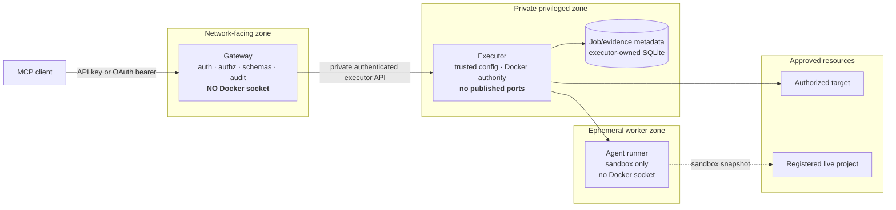

# Security

QuaranGate is designed around **governed authority**, not trust in an AI model's intent.

A prompt can ask an agent to behave safely. QuaranGate's security model assumes that prompt instructions alone are not enough. Access decisions are enforced through authenticated principals, explicit grants, path confinement, isolated containers, bounded execution, stored evidence and separate promotion authority.

> [!WARNING]
> The private executor holds `/var/run/docker.sock`. Docker socket access is effectively host-level authority. The architecture reduces where that authority is exposed; it does not make Docker authority low risk.

---

## Contents

- [Security objectives](#security-objectives)
- [Trust zones](#trust-zones)
- [Credential hashing and client identity](#credential-hashing-and-client-identity)
- [OAuth 2.1 browser authorization](#oauth-21-browser-authorization)
- [Authorization model](#authorization-model)
- [Gateway and executor separation](#gateway-and-executor-separation)
- [Target and workspace confinement](#target-and-workspace-confinement)
- [Agent sandbox isolation](#agent-sandbox-isolation)
- [Evidence, diff and promotion authority](#evidence-diff-and-promotion-authority)
- [Apply safety, rollback and quarantine](#apply-safety-rollback-and-quarantine)
- [Secrets and provider credentials](#secrets-and-provider-credentials)
- [Network and data-leakage boundaries](#network-and-data-leakage-boundaries)
- [Audit and retention](#audit-and-retention)
- [Threat model](#threat-model)
- [Residual risks](#residual-risks)
- [Security rules that must not regress](#security-rules-that-must-not-regress)

---

# Security objectives

QuaranGate aims to preserve these properties:

1. **A remote client cannot invent new authority.** It can only request capabilities already granted to its principal.
2. **The network-facing component does not hold Docker authority.**
3. **A caller cannot select arbitrary host paths, Docker mounts, runner images, network modes or privilege flags.**
4. **Direct target operations remain confined to the configured workspace.**
5. **Write-capable coding agents work in isolated sandboxes by default.**
6. **Completing an agent job does not authorize application to live source.**
7. **The artifact reviewed is the artifact QuaranGate attempts to apply.**
8. **Ambiguous recovery fails closed rather than being reported as success.**
9. **Credentials and raw sensitive bodies are not deliberately placed into source control, MCP results or audit records.**
10. **Historical evidence remains attributable and is not rewritten to make past state look current.**

These are engineering controls. They are not claims that QuaranGate removes every host or Docker risk.

---

# Trust zones

The current system deliberately separates privilege.



### Why this split exists

The gateway is the component that may accept external MCP traffic. The executor is the component that needs Docker control. Giving both responsibilities to one process would make compromise of the public boundary much more dangerous.

A compromised gateway does **not** automatically gain raw Docker or arbitrary host authority. It remains mediated by the executor's narrow API, trusted target/project configuration and independent validation.

That statement is intentionally narrower than saying “a compromised gateway cannot affect the host”. A gateway compromise that can successfully exercise an authorized executor operation can still cause whatever effects that authorized operation permits. The purpose of the boundary is to **constrain** the available authority, not to pretend the privileged executor does not exist.

---

# Credential hashing and client identity

## Static API keys

Each client is represented by a separate principal in `config/clients.yaml`.

A generated client key is intended to be shown to the operator/client once. QuaranGate stores only its **SHA-256 hash** (`keyHash`) in normal configuration.

```text
raw API key
   │
   ├──> client stores raw secret
   │
   └──> SHA-256
          │
          └──> QuaranGate stores keyHash
```

### Why hash the key?

If committed configuration or a backup containing `keyHash` is exposed, the original reusable credential should not be sitting there in plaintext.

This is particularly useful because client identities are intentionally long-lived configuration objects while raw secrets should be rotatable independently.

### What hashing does not solve

- If the **raw key** is leaked from the client, shell history, chat transcript or another secret store, it is compromised and must be rotated.
- A hash does not reduce the authority of a valid raw credential. Scopes and allowlists do that.
- Hashing does not replace transport security.

A previously exposed credential in this project's history was treated as compromised and rotated. That remains the correct handling rule: **a raw credential shown in an uncontrolled transcript is no longer trusted.**

## Per-client principals

Principals have independent:

- identity;
- enabled/disabled state;
- API key hash;
- scopes;
- target allowlist;
- agent project/backend/profile grants;
- optional rate limits.

### Why separate principals?

A ChatGPT credential, Claude credential and IDE credential should not have to share one global secret or one global permission set.

Compromise or revocation of one principal should not require replacing every other client's credential.

---

# OAuth 2.1 browser authorization

Browser clients that require OAuth use a small standards-compatible authorization façade.

The implemented browser path includes:

- Protected Resource metadata;
- Authorization Server metadata;
- JSON Dynamic Client Registration for public clients;
- exact redirect URI validation;
- authorization code flow;
- **PKCE S256**;
- MCP resource binding;
- single-use authorization codes;
- rotating refresh tokens;
- bounded persisted OAuth state;
- hashed persisted sensitive OAuth token/state material;
- restrictive authorization-page content security policy.

The OAuth bearer resolves to the **same QuaranGate principal model** as a static API key. OAuth changes the authentication mechanism; it does not bypass authorization.

## Why PKCE S256?

PKCE binds an authorization code to the client instance that initiated the flow. Intercepting the authorization code by itself should not be sufficient to exchange it for a token without the matching verifier.

## Why exact redirect validation?

A browser authorization flow must not be allowed to redirect tokens/codes to an arbitrary destination supplied at runtime.

## Why resource binding?

A token issued for the MCP resource should be bound to that intended resource rather than treated as an ambient bearer for unrelated services.

## Persistent OAuth storage

The gateway's persistent data directory is separate from the executor job database. Existing hardening records the gateway data directory as private to the non-root gateway process and sensitive state files with restrictive permissions.

---

# Authorization model

Authentication answers:

> Who is this caller?

Authorization separately answers:

> What may that caller do, and where?

## Direct target operations

A target operation requires the appropriate scope and an authorized target.

Examples:

```text
files:read
files:write
files:delete
terminal:exec
git:read
process:read
```

Target discovery does not grant target authority.

## Agent Control Plane

The implemented agent scopes are:

```text
agents:read
agents:dispatch
agents:cancel
agents:apply
```

Agent authorization additionally considers:

```text
principal
operation
project
backend
profile
job ownership
```

Missing grants mean **deny**.

Target authority does not imply agent authority.

`agent_apply` requires separate apply authority and cannot be reached merely because a caller was allowed to dispatch a job.

## IDE Session Control

The North-Star IDE Session Control Plane is separately authorized. Agent Dispatch authority must not imply authority over active IDE sessions, and IDE-session discovery must not create ambient access to every IDE open on the host.

---

# Gateway and executor separation

## Gateway

The gateway is responsible for:

- MCP protocol handling;
- client authentication;
- principal resolution;
- scope/grant checks;
- strict input/output schemas;
- rate limiting;
- audit;
- forwarding a bounded operation to the executor.

It must not receive `/var/run/docker.sock`.

## Executor

The executor:

- is private/unpublished;
- holds Docker socket access;
- resolves targets/projects using trusted configuration;
- re-validates target/workspace and agent/project policy independently;
- owns durable agent job/evidence metadata;
- controls ephemeral runners/helpers.

## Why independently validate in the executor?

The gateway is not treated as the only security boundary. The privileged component should not blindly trust caller-shaped values simply because they came through another QuaranGate service.

This is defense in depth, not a claim that the executor is safe if fully compromised.

---

# Target and workspace confinement

Direct target filesystem operations accept **workspace-relative** paths.

The path model rejects or confines:

- absolute paths;
- `..` traversal;
- null bytes;
- platform path tricks covered by the path grammar;
- symlink/nested-symlink resolution outside the configured workspace.

The executor canonicalizes the configured workspace and the requested path or nearest existing ancestor **inside the target**, then verifies the operation stays under the approved root.

Content IO uses Docker archive operations where appropriate; other non-terminal operations use bounded argv-style execution rather than shell-concatenated path strings.

### Why canonicalize in the target?

A path such as:

```text
workspace/link -> /etc
```

may appear syntactically inside the workspace while resolving elsewhere. String-prefix checks are not enough.

### Residual TOCTOU risk

Canonicalization occurs immediately before the operation, but an attacker that already controls the target filesystem could attempt to change a symlink between verification and use.

That race is narrowed, not mathematically eliminated.

---

# Agent sandbox isolation

The Agent Control Plane does not normally give a write-capable coding model the real project as its read/write workspace.

The intended/implemented lifecycle is:

```text
trusted project
     ↓
controlled snapshot/staging
     ↓
Docker-managed sandbox storage
     ↓
ephemeral runner
```

Runner hardening includes the established A3-A5 controls:

- non-root execution;
- non-privileged container;
- `CapDrop=ALL`;
- `no-new-privileges`;
- read-only root filesystem;
- no Docker socket;
- no arbitrary host binds;
- private namespaces;
- exact CPU/memory/PID/runtime/output limits;
- egress policy restricted to `deny` or `backend-only` rather than an ordinary unrestricted mode.

### Why sandbox first?

An agent prompt is not a safe promotion boundary. Keeping implementation away from live source gives QuaranGate an opportunity to measure what changed before deciding whether it is acceptable.

---

# Evidence, diff and promotion authority

## Agent result is not proof by itself

A model may state:

> I changed two files and all tests passed.

QuaranGate separately derives evidence from the sandbox/job state.

## `agent_diff`

`agent_diff` exposes bounded, machine-derived change evidence rather than blindly repeating agent prose.

The contract includes integrity metadata such as a full-diff hash and bounded/cursor-based retrieval for large evidence.

### Why bounded retrieval?

Evidence should be complete enough to audit without turning one MCP result into an unbounded memory/transport dump.

## `agent_apply`

`agent_apply` takes **no caller-supplied patch text**.

It operates against stored evidence associated with the completed job.

### Why?

If the reviewer approves artifact A, the apply path must not accept artifact B from a later caller message.

The evidence being promoted must remain bound to the job that produced it.

---

# Apply safety, rollback and quarantine

Apply is deliberately treated as a high-risk transition.

Current controls include:

- `agents:apply` scope;
- exact job ownership;
- project grant;
- completed-job prerequisite;
- one-time disposition;
- base-state verification;
- guarded-path validation;
- fail-closed patch/application checks;
- dedicated short-lived apply helper rather than reusing the agent runner;
- durable apply-attempt evidence;
- rollback verification;
- quarantine when rollback cannot be proven.

## Stale source protection

A job records the source/base state it was created from. If the live project has changed incompatibly before apply, QuaranGate refuses rather than guessing how to merge old work into new source.

### Why?

Review evidence is only meaningful relative to the state that produced it.

## Guarded paths

Projects may designate sensitive paths that a normal apply may not modify.

Typical classes include secrets, credentials, security configuration and other owner-controlled files.

### Why?

A coding agent does not gain stronger authority merely because it can produce a syntactically valid patch.

## `UNCERTAIN` and project quarantine

If apply fails and rollback can be proven, the failure can be classified without claiming a net change.

If rollback **cannot** be proven, QuaranGate records uncertainty and blocks further apply activity for the project.

### Why?

The dangerous response to ambiguous mutation is continuing as if nothing happened.

Quarantine makes the uncertainty visible and requires deliberate recovery rather than automated optimism.

---

# Secrets and provider credentials

## Prohibited handling

Secrets should not be:

- committed to the repository;
- baked into images;
- placed in MCP arguments when a safer secret channel exists;
- returned in result objects;
- blindly written to audit logs;
- shared with unrelated backends.

## Backend separation

A Kiro worker should receive only the credential it needs for Kiro. A future Copilot worker should receive only its own credential.

Normal jobs should not receive every provider credential simply because QuaranGate knows how to use several backends.

## Prompt handling

The implemented Agent Control Plane stores the bounded raw prompt in the executor-side job store for execution/recovery needs, while audit/log surfaces use prompt identity/hash rather than blindly reproducing the full body.

This helps separate operational evidence from potentially sensitive user/project text.

## Redaction

Known secret patterns/values should be redacted from logs and returned errors where possible.

Residual risk remains for unusual secret formats embedded in arbitrary terminal command strings. Operators should avoid putting secrets directly into shell command text where a safer mechanism exists.

---

# Network and data-leakage boundaries

QuaranGate distinguishes network planes rather than treating “the machine is local” as a security property.

```text
PUBLIC CONTROL PLANE
external MCP client
        ↓
approved ingress
        ↓
Gateway

PRIVATE EXECUTION/OPERATIONS PLANE
Gateway
        ↓
private executor path

AGENT DATA PLANE
sandboxed runner
        ↓
only the backend egress allowed by policy
```

## Local models

Running inference through local Ollama can remove cloud-model prompt transmission from that model call. It does **not** prove that the surrounding IDE, extension host, package manager, build process or other tooling has no external network path.

This distinction is mandatory in production claims.

## Build-time dependencies

The build-reproducibility work deliberately separates external dependency acquisition from the real source build.

The Tini package-download dependency has already been replaced by an exact local Tini 0.19.0 artifact with SHA-256 verification and recorded provenance.

N1 completed the npm offline-source-build remediation. The dependency preparation phase is source-free and validates the complete lock before the first download; the real Docker build then uses a verified lock-scoped bundle, a fresh tmpfs npm cache and `npm ci --offline --ignore-scripts` under build network `none`.

The accepted claim is **offline source build with approved pre-provisioned inputs**. It is not an empty-machine/no-artifact claim. The preparation container currently uses ordinary Docker bridge networking and relies on exact application-level URL validation (`registry.npmjs.org:443` only) plus mandatory SHA-512 verification rather than kernel-level egress filtering. The Dockerfile also still uses the mutable `node:24-alpine` tag, so cross-machine bit-for-bit base-image reproducibility remains separate hardening work.

---

# Audit and retention

Important actions should be attributable to:

```text
timestamp
request/correlation identity
principal
operation
target or job
project/backend/profile when applicable
decision/outcome
duration
```

Sensitive prompts, tokens, filesystem bodies and provider responses should not be blindly copied into the audit stream.

## Job evidence lifecycle

The A6 retained-resource lifecycle separates:

- physical evidence bytes;
- durable job/apply/quarantine metadata.

Eligible evidence may expire according to retention policy while durable metadata remains available to explain what happened.

Incomplete/orphaned evidence is classified conservatively rather than automatically deleted merely because it is old.

### Why?

Cleanup is a security decision when evidence is part of the proof that a mutation occurred correctly.

---

# Threat model

The table below summarizes the important current threats and the control that limits each one.

| Threat | Main control | Residual risk |
|---|---|---|
| Stolen raw client key | Per-client credentials, scopes, allowlists, revocation/rotation | Valid key can act as that principal until revoked |
| Exposed `keyHash` configuration | Raw API key not stored there | Offline brute force remains theoretically possible; high-entropy keys are required |
| Compromised MCP client | Deterministic server-side authz | Client may use every capability genuinely granted to it |
| Prompt injection | Container/config/policy boundaries do not rely on prompt obedience | Injection can still influence choices inside granted authority |
| Malformed tool input | Strict schemas, typed errors, fail closed | Parser/runtime bugs remain possible |
| Path traversal | Gateway/executor validation + in-target canonicalization | Narrow symlink TOCTOU window remains |
| Wrong/ambiguous target | Logical IDs + trusted resolver + ambiguity refusal | Misconfiguration remains an operator risk |
| Arbitrary Docker control | Raw socket kept in private executor; narrow API | Executor compromise is high impact |
| Agent reaches host files | Sandbox volume, no host binds, no Docker socket | Kernel/container-runtime vulnerability remains possible |
| Two writers race on one project | Writer policy + apply/live-writer arbitration | Future concurrency features must preserve the invariant |
| Stale patch | Recorded base-state verification | User must regenerate/reconcile work after legitimate source drift |
| Agent changes protected files | Guarded-path apply policy | Guard configuration must be maintained correctly |
| Partial/failed apply | Apply journal + rollback proof + quarantine | Manual recovery may be required after `UNCERTAIN` |
| Runaway agent/process | CPU/memory/PID/runtime/output bounds | Best-effort cleanup cannot guarantee every detached target process dies immediately |
| Credential output | Secret isolation + redaction | Novel/unrecognized secret formats can evade pattern-based redaction |
| Local-model leakage assumption | Separate egress qualification | Other host/IDE/build processes may still network |
| Build dependency drift | Pinned/local artifact work + integrity verification | Supply-chain governance still depends on approved artifact acquisition |

---

# Residual risks

## Docker socket authority

This is the primary structural residual risk.

The executor's Docker socket access is required for the current target/runner architecture. If the executor itself is compromised, the impact may be severe despite its container hardening.

Mitigations reduce exposure:

- no public port;
- private service path;
- internal token;
- non-root process;
- read-only filesystem;
- dropped capabilities;
- narrow application API.

They do not turn Docker authority into a low-privilege capability.

## Authorized terminal power

A principal granted `terminal:exec` can intentionally run shell commands inside the authorized target workspace/container subject to QuaranGate's bounds.

That is an intended capability and should be granted conservatively.

## Symlink race

Canonical path checking narrows but does not entirely eliminate a race where an already-compromised target modifies filesystem links between validation and operation.

## Timeout cleanup

Docker exec does not provide a perfect kill primitive for every detached descendant. Cleanup is bounded/best effort.

## Operator configuration

QuaranGate can enforce configured boundaries, but a dangerously broad target/project/principal configuration is still dangerous.

Least privilege remains an operator responsibility.

---

# Security rules that must not regress

The following are architecture-level stop conditions, not ordinary bugs to work around:

```text
gateway receives docker.sock
executor becomes publicly published
runner receives docker.sock
runner receives arbitrary host bind
caller can choose host project path
caller can choose privileged/network/container options
missing agent grants become allow
agent completion automatically applies live changes
agent_apply accepts arbitrary caller patch text
stale base-state check can be bypassed
uncertain rollback is reported as success
credentials appear in committed config/result/audit evidence
local inference is claimed to prove entire IDE/build air-gap
```

If a future feature requires weakening one of these boundaries, that change requires an explicit architecture/security decision rather than being hidden inside implementation work.
