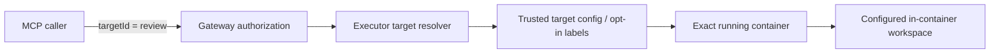

# Targets

Targets are the Docker containers QuaranGate may operate on through its direct MCP tool surface.

A target is **not** the host. It is a deliberately registered or opt-in container with a defined in-container workspace and an independent client authorization boundary.

---

## Contents

- [Target model](#target-model)
- [Why callers use logical IDs](#why-callers-use-logical-ids)
- [Manual targets](#manual-targets)
- [Opt-in discovery](#opt-in-discovery)
- [Authorization](#authorization)
- [Workspace boundary](#workspace-boundary)
- [Fail-closed resolution](#fail-closed-resolution)
- [Minimum target requirements](#minimum-target-requirements)
- [Target lanes shipped with QuaranGate](#target-lanes-shipped-with-quarangate)
- [Read-only review lanes](#read-only-review-lanes)
- [Constrained write lane](#constrained-write-lane)
- [Adding an existing project as a target](#adding-an-existing-project-as-a-target)
- [Target security checklist](#target-security-checklist)

---

# Target model

The direct tool surface addresses a target by an operator-defined ID such as:

```text
demo
mcp-ide-bridge-review
assistant-environment-review
```

The trusted target definition maps that logical identity to a real running container and an absolute **path inside that container** that becomes the authorized workspace.



The client does not get to replace that mapping with arbitrary Docker parameters.

---

# Why callers use logical IDs

Public input should look like:

```json
{
  "target": "mcp-ide-bridge-review",
  "path": "src/executor/index.ts"
}
```

not:

```json
{
  "container": "some-random-container-id",
  "hostPath": "/home/herman",
  "mount": "/"
}
```

### Why?

If the caller could choose the container or host path directly, the target registry would not be an authorization boundary.

Logical IDs let QuaranGate expose a stable API while keeping Docker/host details under operator control.

---

# Manual targets

Manual targets are the recommended model for stable environments.

A trusted configuration entry identifies the target using stable deployment metadata such as a Compose project/service and defines the in-container workspace.

Conceptually:

```yaml
targets:
  - id: mcp-ide-bridge-review
    composeProject: mcp-ide-bridge-review
    composeService: review
    workspace: /workspace
```

The exact committed example schema is authoritative for the current release.

## Why use Compose identity instead of one container ID?

Container IDs change when a service is recreated.

A logical mapping based on the intended deployment identity allows QuaranGate to resolve the current running container rather than storing a transient Docker ID as the public contract.

---

# Opt-in discovery

QuaranGate also supports explicit label-based discovery.

A container must deliberately opt in using the target-discovery label contract, including an approved in-container workspace.

Discovery means:

> This container identifies itself as a QuaranGate target candidate.

It does **not** mean:

> Every QuaranGate client may use it.

That second decision belongs to principal authorization.

## Why discovery is separate from authorization

Infrastructure ownership and client permissions change for different reasons.

An operator may make a container discoverable while allowing only one review principal to inspect it.

---

# Authorization

Two independent questions must both resolve successfully:

```text
Does the target exist / resolve unambiguously?
               AND
May this principal use that target?
```

A target listed in Docker but absent from a client's allowlist remains unavailable to that client.

A principal using:

```yaml
targets: ["*"]
```

means all targets in QuaranGate's trusted configured/discovered target registry, **not every Docker container on the host**.

---

# Workspace boundary

Each target has one configured workspace root.

Direct filesystem and terminal operations are confined relative to that root.

Example:

```text
target workspace: /workspace
public path:       src/index.ts
resolved target:  /workspace/src/index.ts
```

The path model rejects traversal/absolute-path forms and the executor verifies the canonical in-target path remains under the canonical workspace.

### Why not let the caller choose `cwd=/`?

A target is intentionally smaller than “the whole container”. The workspace is the configured engineering boundary.

---

# Fail-closed resolution

Target resolution is conservative.

Examples:

| Condition | Result |
|---|---|
| Unknown target ID | Refused |
| No running container for required target | `TARGET_OFFLINE` / refused |
| Multiple running containers match a supposedly unique target | `AMBIGUOUS_TARGET` / refused |
| Path escapes configured workspace | Refused |
| Target lacks required runtime capability | `TARGET_UNSUPPORTED` / refused |

### Why ambiguity is an error

QuaranGate should never “pick one” when more than one live container matches a target identity. Acting on the wrong development environment is a security and correctness failure.

---

# Minimum target requirements

The exact requirement depends on the tool being used.

The current direct execution model generally assumes:

- Linux/POSIX-style target environment;
- `/bin/sh` for terminal execution;
- canonical-path support such as `readlink -f` or `realpath` for confinement;
- Git only when Git tools are requested;
- the configured workspace exists and is accessible to the container's normal user/policy.

Shell-less/distroless/scratch containers are not normal v1 interactive targets and should fail clearly rather than causing QuaranGate to improvise an unsafe fallback.

---

# Target lanes shipped with QuaranGate

The repository includes target definitions representing different authority models.

| Lane | Source access | Git metadata | Intended use |
|---|---|---|---|
| Disposable test target | Fixture-owned | Fixture-owned | Integration/adversarial tests |
| Review target | Read-only | Read-only as part of source mount | Independent source review/audit |
| Assistant review target | Read-only | Read-only | Review lane for another approved project |
| Assistant work target | Read/write source | `.git` read-only | Constrained file-edit lane without Git mutation |

These lanes exist because “can edit files” and “can rewrite repository history” are different authorities.

---

# Read-only review lanes

A review target mounts project source read-only.

This is useful when a remote client needs to:

- inspect source;
- run read-only/search/test commands that do not require source mutation;
- inspect Git history/state;
- audit another writer's candidate.

The Docker-level read-only mount is stronger than telling the model:

> Please do not edit files.

### Why?

Prompt restrictions are behavioral requests. A read-only mount is an operating-system/container enforcement boundary.

---

# Constrained write lane

The assistant work lane demonstrates a different design:

```text
source tree: read/write
.git:        read-only
```

This allows ordinary file editing while preventing normal Git staging/commit/branch/rebase/push mutations through that mounted worktree.

The lane also runs with an ordinary non-root UID/GID and dropped capabilities so files are created with normal developer ownership rather than privileged ownership.

### Why separate source write from Git write?

An editor/worker may legitimately need to change files while promotion/history remains a different review authority.

This follows the same QuaranGate principle used by Agent Control Plane apply:

```text
create candidate
    !=
promote candidate
```

---

# Adding an existing project as a target

A project should be added deliberately rather than by exposing the host broadly.

The safe pattern is:

1. decide whether the lane is read-only or read/write;
2. mount only the project needed by that lane;
3. set the in-container workspace explicitly;
4. avoid mounting host home directories or unrelated projects;
5. avoid the Docker socket unless the target is specifically a privileged infrastructure component—which ordinary development targets should not be;
6. use an ordinary non-root user where practical;
7. opt the container into QuaranGate target discovery or add a manual target entry;
8. grant the target only to the client principals that need it;
9. validate `targets_list` and `target_inspect` before granting write/terminal authority.

## Read-only example pattern

Conceptually:

```yaml
volumes:
  - type: bind
    source: /approved/project
    target: /workspace
    read_only: true
```

## Constrained write example pattern

Conceptually:

```yaml
volumes:
  - type: bind
    source: /approved/project
    target: /workspace
    read_only: false

  - type: bind
    source: /approved/project/.git
    target: /workspace/.git
    read_only: true
```

Do not copy these examples blindly if the project's ownership/UID model differs. The target compose/config shipped in the repository is the source of truth for the current implementation.

---

# Target security checklist

Before treating a new target as accepted, verify:

```text
[ ] target ID is logical and stable
[ ] container resolves uniquely
[ ] workspace is explicit
[ ] source mount is no broader than necessary
[ ] read-only lane is actually Docker-read-only
[ ] write lane uses expected UID/GID and permissions
[ ] Docker socket is absent unless explicitly required by architecture
[ ] unrelated host directories are absent
[ ] target is not reachable by principals that do not need it
[ ] traversal/symlink confinement is exercised
[ ] terminal authority is granted separately from read authority
[ ] target survives/re-resolves correctly after expected recreation
```

A target is an authorization boundary. Treat its Compose/mount configuration with the same care as the MCP permission model.
